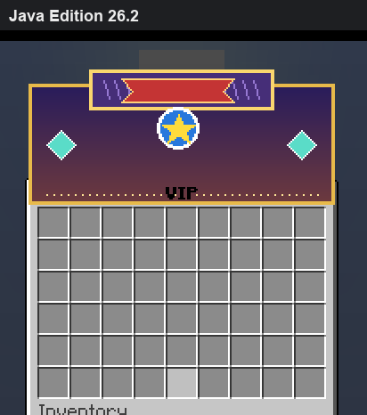
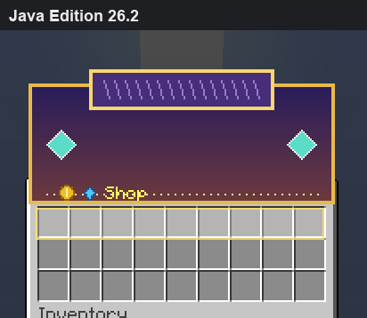
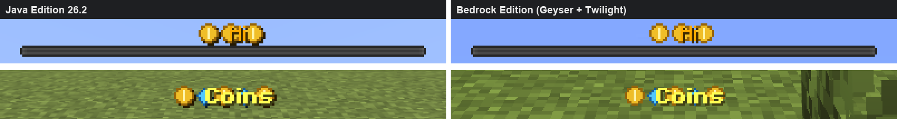
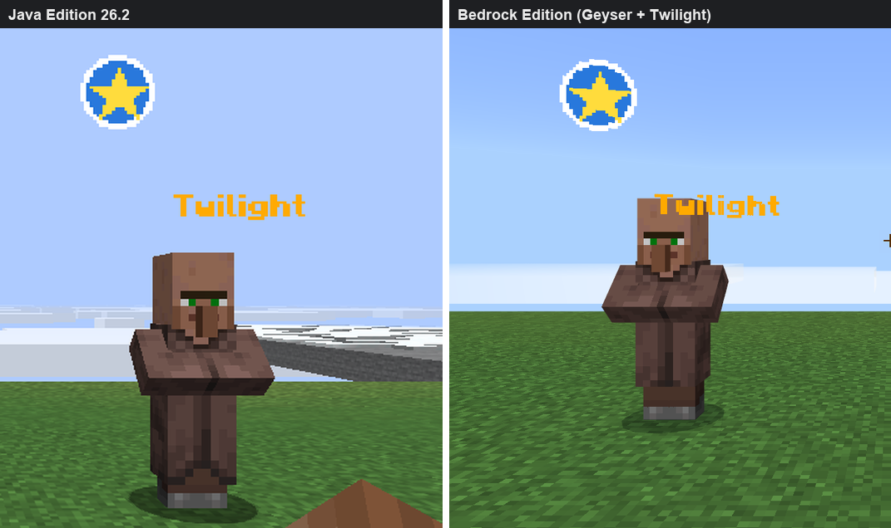
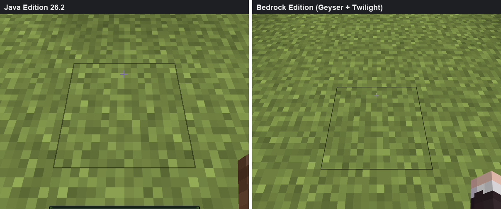
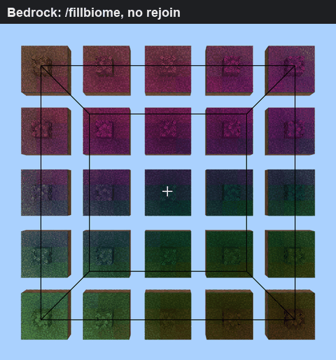
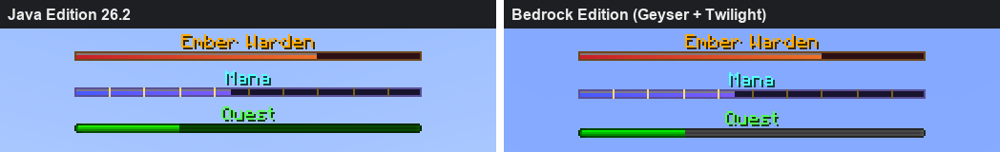
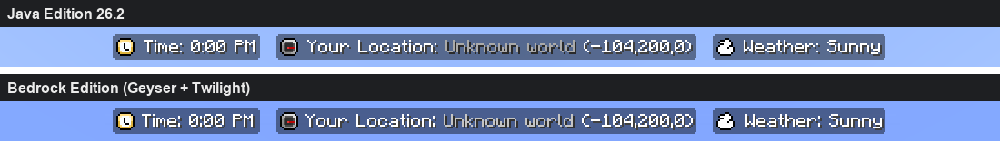
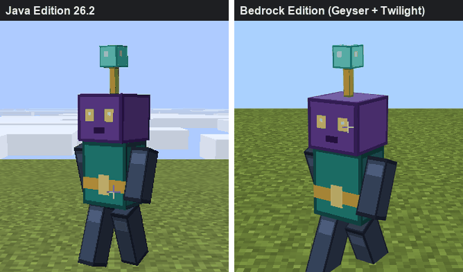
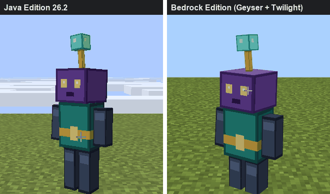

# Twilight

> Türkçe: [aşağıda](#türkçe)

[](LICENSE.LESSER)
[](#requirements)
[](#twilight-proxy)
[](WIKI.md)

Twilight is a server-side Java-to-Bedrock custom-content compiler for Geyser. It discovers content generated by server plugins and datapacks, converts supported Java item assets into a Bedrock resource pack, writes Geyser custom mappings, validates the result, and can deploy it transactionally. Players do not install a client mod.

The [wiki](WIKI.md) is the reference for installation, commands, every configuration key, files, the API and the security model. The current capability matrix and version-specific limitations are documented in [docs/COMPATIBILITY.md](docs/COMPATIBILITY.md). Strict conversion fails closed when content cannot be represented safely.

The [expanded acceptance contract](docs/COMPATIBILITY_REVIEW_2026-10-03.md)
tracks 40 areas and 289 required scenarios, including menus, tooltips and live
HUDs. These are acceptance obligations, not a count of passing tests.

## Visual acceptance tests

Every capture below is original art, a vanilla scene or CustomNameplates' own default art
(Apache-2.0) from the isolated test server, on Java 26.2 and Bedrock 1.26.5203.0 (Geyser 2.11.3).
The menu animations alternate the Java and the Bedrock frame of the same menu: nothing moves
because the art lands on the same pixels. Details, measurements and hashes are in
[stacked images, nameplates and exact biomes](docs/LAYERS_BIOMES_2026-10-04.md) (4 October, 1.0.0-pre.8)
and [custom boss bars, CustomNameplates' boss bar and an animated model](docs/BOSSBARS_MODELS_2026-10-05.md)
(5 October, 1.0.0-pre.10).

<table>
  <tr>
    <th>Stacked images: panel, banner, badge and text</th>
    <th>Translucent highlight over the slots</th>
  </tr>
  <tr>
    <td></td>
    <td></td>
  </tr>
  <tr>
    <th colspan="2">Boss bar and action bar text drawn over images</th>
  </tr>
  <tr>
    <td colspan="2"></td>
  </tr>
  <tr>
    <th colspan="2">Nameplate: a text display riding a named villager (the vehicle's own name is hidden, as on Java)</th>
  </tr>
  <tr>
    <td colspan="2"></td>
  </tr>
  <tr>
    <th>Custom datapack biome in its exact colours</th>
    <th>Biome changes reach Bedrock without a rejoin</th>
  </tr>
  <tr>
    <td></td>
    <td></td>
  </tr>
  <tr>
    <th colspan="2">Boss bars with redrawn sprites: framed health bar, notched mana bar, vanilla bar</th>
  </tr>
  <tr>
    <td colspan="2"></td>
  </tr>
  <tr>
    <th colspan="2">CustomNameplates' default boss bar: backgrounds, icons and shifted text (Java above, Bedrock below)</th>
  </tr>
  <tr>
    <td colspan="2"></td>
  </tr>
  <tr>
    <th>Animated BetterModel mob: walk</th>
    <th>Animated BetterModel mob: idle</th>
  </tr>
  <tr>
    <td></td>
    <td></td>
  </tr>
</table>

Further side-by-side menus:
[layered title](docs/images/acceptance/2026-10-04-layers/menus/layered-bold.png),
[title without a colour](docs/images/acceptance/2026-10-04-layers/menus/header-uncoloured.png),
[white title](docs/images/acceptance/2026-10-04-layers/menus/header-white.png),
[icons and spaces](docs/images/acceptance/2026-10-04-layers/menus/icon-row.png),
[negative-height shifts](docs/images/acceptance/2026-10-04-layers/menus/negative-height.png),
[hex text](docs/images/acceptance/2026-10-04-layers/menus/hex-text.png) and
[bold text](docs/images/acceptance/2026-10-04-layers/menus/bold-text.png). All nine
styles land at offset 0, 0 in GUI units. Complete strict builds of seven production
servers passed with the default configuration. The [UI campaign](docs/UI_CAMPAIGN_2026-10-04.md)
covers 104 real menus of two servers (measurements only). The locally built
[1.0.0-pre.10 JARs and checksums](artifacts/) accompany the source. Full visual parity
is not established; known differences are listed in the report.

Older reports keep their measurements:
[real content](docs/REAL_CONTENT_REVIEW.md),
[cloud anchors](docs/CLOUD_ANCHORS_2026-09-29.md),
[mount heights](docs/DISPLAY_SEATS_2026-09-29.md),
[extended content](docs/BROAD_CONTENT_2026-09-29.md),
[composite models](docs/COMPOSITE_MODELS_2026-09-30.md),
[font metrics](docs/FONT_METRICS_2026-10-01.md),
[wide glyphs](docs/WIDE_GLYPHS_2026-10-02.md),
[container layout](docs/CONTAINER_LAYOUT_2026-10-03.md),
[text layout](docs/TEXT_LAYOUT_2026-10-03.md) and
[text surfaces](docs/TEXT_SURFACES_2026-10-04.md).

## Requirements

- Java 21 or newer
- Spigot, Paper, or Folia 1.21.4 or newer
- Geyser with custom content enabled for generated mappings and packs
- Bedrock clients of the current release; Twilight targets the newest Bedrock and Java versions first
  (tested with Java 26.2 and Bedrock 1.26.5203.0) and older clients as far as Geyser supports them

Releases contain two plugins: `Twilight.jar` for backend servers and `TwilightProxy.jar` for Velocity or BungeeCord proxies (optional; see [twilight-proxy](#twilight-proxy)). Fabric client support has ended.

## Discovery and automation

Twilight resolves `level-name` from `server.properties`, active Bukkit worlds, their datapacks, and generated content under supported provider directories. Current discovery recognizes ItemsAdder, CraftEngine, Nexo, Oraxen, BetterModel, ModelEngine, RealisticSeasons, and explicitly configured pack sources. Provider `contents`/`resources`, `data`, and `cache` metadata and asset roots are indexed in that order of authority; generated ZIPs remain the lower-priority fallback for files absent from those roots. Copies of the vanilla client assets, temporary build folders and stale packs nested in a provider's working folder are ignored; a renamed ItemsAdder output pack is used when `generated.zip` is absent. Standard assets remain the source of truth, so compatible providers can work through the file and Bukkit APIs without vendor-specific conversion code.

The runtime collector inspects recipe results, online player inventories, modern `minecraft:item_model` components, legacy custom model data, and public ItemsAdder, CraftEngine, Nexo, and Oraxen item registries when available. Supported provider load, reload, and pack-generation events plus content-changing commands trigger a debounced conversion and delayed settle check. File discovery remains available when an API shape changes.

## Installation

1. Put `Twilight.jar` in the server's `plugins` directory and start the server. Nothing has to be
   configured: Twilight finds the providers, builds, deploys to Geyser and reloads it.
2. Optionally review `plugins/Twilight/config.yml`:
   - `sources.providers`: per provider `auto` (default), `generated` (only the pack the provider
     generates), `contents` (only its working folders) or `false`; `sources.datapacks` and
     `sources.additional` for world datapacks and further packs.
   - `geyser.send-pack-to-bedrock: false` when another plugin or a proxy sends the pack: every build is
     also written to `plugins/Twilight/export` (`Twilight.mcpack` and Geyser item mappings).
   - Keep `vanilla-override: false` unless replacing vanilla presentation is intentional.
3. `/twilight scan` and `/twilight convert` run the same steps by hand. Results are in
   `plugins/Twilight/reports`, `plugins/Twilight/logs` and `plugins/Twilight/build/current`.

With default automation enabled, Twilight performs a delayed conversion after server/provider loading, deploys a validated build to the local Geyser directory, and reports a required server restart when item mappings differ from the startup set. `/geyser reload` cannot rebuild the item registry; unchanged mappings permit a controlled resource reload. A failed strict build never replaces the last known-good output; when no pack is deployed yet, the first build deploys without the reported content so Bedrock players are never left without a pack. No setting has to be changed for this: the defaults build, deploy and reload on their own.

## twilight-proxy

`TwilightProxy.jar` gives every backend server its own Bedrock pack when Geyser runs on a Velocity
(3.x, 4.x) or BungeeCord/Waterfall proxy. Bedrock loads packs only when it connects, so a Bedrock
player loads the pack of the server they join; moving to a server with another pack reconnects the
client to Geyser, which loads that pack and sends the player on (about five seconds with a cached
pack). Each server's pack comes from its configuration:

```yaml
packs:
  default: auto
  server:
    lobby: auto                                  # built by Twilight on that backend
    smp: https://example.com/packs/smp.mcpack    # direct download link
    survival: survival.zip                       # file in plugins/twilight-proxy/packs/
```

`auto` packs travel from Twilight on the backend over signed plugin messages (HMAC-SHA256 with
the secret the proxy already shares with its servers: Velocity forwarding or BungeeGuard, or an
explicit `secret`). Clients can neither read nor forge them. Packs are size-limited and checked
before Geyser sees them, transfers are bounded per player, and failed downloads keep the previous
pack. Both proxies were tested live with two backends; see the
[proxy test](docs/PROXY_2026-10-05.md) and the [wiki](WIKI.md#twilight-proxy-1).

Login plugins (AuthMe, LibreLogin, nLogin, JPremium) keep the last word on a reconnect: a player sent
to the login server first goes on to the server it chose after logging in. Reconnect deadlines grow
with the pack and every step is logged; see the
[reconnect test](docs/PROXY_RECONNECT_2026-10-08.md). Tested with LeaderOS Auth Plus, BungeeGuard,
Floodgate and Velocity modern forwarding ([login plugin test](docs/PROXY_AUTH_2026-10-09.md)).

Custom items work on a proxy without copying files: twilight-proxy merges every backend's Geyser item
mappings into the proxy's Geyser, where the same Java item is the same Bedrock item on every backend
and each server's pack decides its look ([field report](docs/FIELD_REPORT_2026-10-09.md),
[wiki](WIKI.md#item-mappings-on-a-proxy)).

## Pack hosting

Bedrock players can download the packs over HTTP from the server that runs Geyser (a backend or the
proxy) instead of Geyser's slower in-game transfer, like ItemsAdder's or CraftEngine's self-host:

```yaml
pack-host:        # plugins/Twilight/config.yml or plugins/twilight-proxy/config.yml
  enabled: true
  port: 8163      # open this TCP port
```

Unlike a public pack link, a pack can only be fetched with a link minted for one Bedrock player who
is connecting through Geyser: a random 256-bit token, valid for a few minutes and downloads, and by
default only from that player's IP address. Everything else gets an empty 404, guessing is rate
limited and blocked, and a failed download falls back to Geyser's own transfer, so joining never
depends on it. Every pack of the session is hosted (Twilight's, Geyser's and other plugins' files).
Reverse proxies, HTTPS, NAT and DDoS fronts are covered in the [wiki](WIKI.md#pack-hosting).

## Updates

Releases are published on [GitHub](https://github.com/siberanka/twilight/releases) and mirrored on
[GitLab](https://gitlab.com/siberanka/twilight/-/releases); every change is a new version. Twilight and
twilight-proxy check for a newer release at start and every six hours (GitHub first, GitLab when GitHub
cannot be reached) and tell the console and players with `twilight.update` (operators) or
`twilight.proxy.update`. Nothing about the server is sent and nothing is downloaded; turn it off with
`update-check.enabled: false` ([wiki](WIKI.md#updates)).

## Commands

| Command | Purpose |
|---|---|
| `/twilight status` | Show operation, scan, Geyser, backup and update check state. |
| `/twilight scan` | Discover and inspect sources without converting. |
| `/twilight convert` | Scan, convert, validate, and optionally deploy. `/twilight build` is an alias. |
| `/twilight deploy` | Deploy the current validated output to Geyser. |
| `/twilight rollback [index]` | Restore a retained Geyser deployment snapshot. |
| `/twilight reload` | Reload and validate Twilight configuration. |

Each operation writes a dedicated UTF-8 log under `plugins/Twilight/logs`, for example `convert-log-20260921-153000-000-a1b2c3d4.txt`. Logs include phases, selected sources, counts, isolated conversion problems, the executing thread, and complete stack traces.

## Conversion and safety contract

- Modern Java item-definition trees support plain models, conditions, range dispatch, selects, static composites, and special-model bases where Geyser has an equivalent predicate.
- Legacy numeric custom-model-data overrides remain supported.
- Animated item textures currently export the first authored frame. Full `.mcmeta` animation playback is not implemented.
- Layered 2D textures are composed without smoothing. Java cuboids remain volumetric Bedrock geometry with separate first/third-person left/right and head transforms. Handheld presentation follows the resolved Java model parent, while authored hand translation, rotation, and scale are preserved without implicit fitting.
- Single-layer texture-only bows and crossbows reuse Bedrock's native pose, pull geometry, and animation controllers. Volumetric legacy pull stages retain separate Java geometry and display transforms behind one runtime-selected Bedrock attachable. Crossbow arrow/rocket loads and fishing-rod cast models become explicit Geyser predicates, preserving their distinct states.
- Supported bitmap providers use adaptive 16-to-512-pixel cells with measured Java height/ascent alignment. Atlas growth preserves authored display dimensions; overflow beyond the supported bounds and custom spacing fail strict conversion. Six metric probes, 36 real glyphs and six further UI/HUD images were compared in both clients. Chest titles use Java font metrics (spacing, negative shifts, bearings and remapped characters); fractional sampling remains a limitation. Large atlases also increase memory use; see the wide glyph review. Named fonts contribute only globally safe, collision-free BMP private-use glyphs.
- Text is laid out for Bedrock players with Java font metrics (`ui.java-text-layout: true`): fonts from all packs are combined like Java, spacing and negative-shift characters become invisible spacers, and characters Java remaps or named fonts use receive private-use aliases. Chest titles, chat, action bar, titles, boss bars, scoreboards, entity names and text displays are covered (`ui.java-text-surfaces: true`); item names and lore are not. Titles without a colour show their images darkened like Java (`ui.java-glyph-tint: true`), and the packs' translations reach Bedrock players (`ui.java-translations: true`). Text and images moved back over earlier ones (stacked menu art, CustomNameplates backgrounds) get one Bedrock label per layer in chest titles, the action bar and boss bars (`ui.java-text-layers: true`). A glyph directly after text without a space can still differ by a unit.
- Datapack and plugin biomes keep their exact grass, foliage, water, fog and sky colours and their climate on Bedrock: the pack redefines 25 Bedrock biomes that only old worlds use. With more custom looks, the current RealisticSeasons season goes first and the rest show as the closest vanilla biome or slot; biome changes (`/fillbiome`, seasons) reach Bedrock players without a rejoin (`world.bedrock-biome-matching: true`).
- Ridden players and mobs hide their Bedrock name like Java, so nameplate plugins show only their plate, and Bedrock's dark name tag box is hidden when CustomNameplates draws its own backgrounds (`ui.nametag-background: auto`).
- Desktop chest screens receive Java's container layout (`ui.java-container-layout: true`): unwrapped titles, Java label positions and drawing order, and Java slot spacing for 1 to 6 rows. Twilight merges partial UI definitions instead of replacing Bedrock UI files; other containers and touch layouts stay vanilla.
- With `vanilla-override: false`, normal Unicode cells in the Java default font never replace Bedrock's vanilla glyphs; the text layout gives them private-use aliases instead. Characters drawn from Java's own font sheets stay ordinary Bedrock text.
- Texture atlas sprite renames (for example ItemsAdder's `ia:<number>` sprites) and protected PNGs with broken checksums are resolved like Java. Faces whose texture variable no model defines use Java's missing texture. Content Java rejects or shows broken is converted the way Java shows it (missing textures and models, screen-sized overlay glyphs, vanilla sounds changed without `vanilla-override`) and reported as a notice in `build-report.json` instead of stopping a strict build.
- Explicit `minecraft:` texture references missing from a custom pack can be resolved from a version-matched Mojang client JAR cached under `plugins/Twilight/cache`. Manifest metadata, size, and SHA-1 are verified before use; this never registers vanilla models as custom content.
- Layered Java `sounds.json` registries, file/event references, OGG assets, weights, pitch, volume, streaming, and attenuation are converted to Bedrock sound definitions. Explicit vanilla sound dependencies use the same version-matched, hash-verified Mojang asset chain.
- Vanilla items without a custom definition are never registered. `vanilla-override` defaults to `false`.
- ZIP traversal, symbolic source entries, oversized sources, malformed output JSON, empty archives, duplicate deployment targets, and hash mismatches stop publication.
- Builds use staging plus last-known-good replacement. Geyser deployment stages and hashes every owned file, rolls back on failure, leaves unrelated Geyser files untouched, and retains the newest three snapshots by default.
- Generated archive ordering and timestamps are normalized for repeatable output.

## API and events

Other plugins can obtain the non-blocking Bukkit service:

```java
TwilightApi twilight = Bukkit.getServicesManager().load(TwilightApi.class);
if (twilight != null && !twilight.isOperationRunning()) {
    twilight.requestConvert();
}
```

Twilight fires `TwilightScanCompleteEvent`, `TwilightBuildCompleteEvent`, `TwilightDeployCompleteEvent`, and `TwilightOperationFailedEvent` on the server scheduler. The failure event includes the per-operation log path and original exception. On a proxy, `TwilightProxyApi.get().pack(server)` returns each server's checked pack. Every method and event is described in the [wiki](WIKI.md#developer-api).

## Building and local validation

```powershell
$env:JAVA_HOME='<path-to-jdk-25>'
$env:GRADLE_OPTS='-Djavax.net.ssl.trustStoreType=Windows-ROOT'
.\gradlew.bat :twilight:build :twilight-proxy:build --no-daemon --no-configuration-cache
```

The JARs are written to `twilight/build/libs/Twilight.jar` and `twilight-proxy/build/libs/TwilightProxy.jar`. Hosted builds are manual-only; pushes do not trigger GitHub Actions.

If Geyser rejects valid mapping type `definition` under a Turkish/Azeri JVM locale, start the server with `-Duser.language=en -Duser.country=US`. Twilight warns about this case without changing the global JVM locale.

## License

Twilight is maintained by `siberanka` and licensed under LGPL-3.0-or-later. Provider names belong to their respective owners and indicate compatibility targets, not affiliation.

---

## Türkçe

### Twilight

Twilight, Geyser için sunucu tarafında çalışan bir Java'dan Bedrock'a özel içerik derleyicisidir. Sunucu
eklentilerinin ve datapack'lerin ürettiği içeriği keşfeder, desteklenen Java eşya varlıklarını bir Bedrock
kaynak paketine dönüştürür, Geyser özel eşlemelerini yazar, sonucu doğrular ve işlemsel olarak dağıtabilir.
Oyuncuların istemci modu kurması gerekmez.

[Wiki](WIKI.md); kurulum, komutlar, her yapılandırma anahtarı, dosyalar, API ve güvenlik modeli için
başvuru kaynağıdır. Geçerli yetenek matrisi ve sürüme özgü sınırlamalar
[docs/COMPATIBILITY.md](docs/COMPATIBILITY.md) içinde belgelenmiştir. Katı dönüşüm, içerik güvenle temsil
edilemediğinde güvenli tarafta kalarak başarısız olur.

[Genişletilmiş kabul sözleşmesi](docs/COMPATIBILITY_REVIEW_2026-10-03.md) menüler, açıklama kutuları ve
canlı HUD'lar dahil 40 alanı ve 289 gerekli senaryoyu izler. Bunlar geçen test sayısı değil, kabul
yükümlülükleridir.

#### Görsel kabul testleri

Yukarıdaki her görüntü özgün görsel, vanilla bir sahne veya CustomNameplates'in kendi varsayılan görselleridir
(Apache-2.0); yalıtılmış test sunucusunda Java 26.2 ve Bedrock 1.26.5203.0 (Geyser 2.11.3) üzerinde çekildi.
Menü animasyonları aynı menünün Java ve Bedrock karesini dönüşümlü gösterir: görsel aynı piksellere oturduğu
için hiçbir şey kımıldamaz. Ayrıntılar, ölçümler ve karmalar [üst üste görseller, ad etiketleri ve birebir
biyomlar](docs/LAYERS_BIOMES_2026-10-04.md) (4 Ekim, 1.0.0-pre.8) ve [özel boss çubukları, CustomNameplates boss
çubuğu ve animasyonlu bir model](docs/BOSSBARS_MODELS_2026-10-05.md) (5 Ekim, 1.0.0-pre.10) belgelerindedir.

Görüntüler: üst üste görseller (panel, afiş, rozet ve yazı), yuvaların üzerinde yarı saydam vurgu, görsellerin
üzerine çizilen boss çubuğu ve aksiyon çubuğu yazısı, ad etiketi (adlı bir köylüye binen yazı görüntüsü;
aracın kendi adı Java'daki gibi gizli), birebir renkleriyle özel datapack biyomu ve yeniden katılmadan
Bedrock'a ulaşan biyom değişiklikleri. Yeni görüntüler: sprite'ları yeniden çizilmiş boss çubukları (çerçeveli can çubuğu, çentikli mana
çubuğu, vanilla çubuk), CustomNameplates'in varsayılan boss çubuğu (arka planlar, simgeler ve kaydırılmış yazı)
ve yürüme ile bekleme animasyonlarıyla özgün bir BetterModel mob modeli.

Diğer yan yana menüler: [katmanlı başlık](docs/images/acceptance/2026-10-04-layers/menus/layered-bold.png),
[renksiz başlık](docs/images/acceptance/2026-10-04-layers/menus/header-uncoloured.png),
[beyaz başlık](docs/images/acceptance/2026-10-04-layers/menus/header-white.png),
[simgeler ve boşluklar](docs/images/acceptance/2026-10-04-layers/menus/icon-row.png),
[negatif yükseklik kaydırmaları](docs/images/acceptance/2026-10-04-layers/menus/negative-height.png),
[hex yazı](docs/images/acceptance/2026-10-04-layers/menus/hex-text.png) ve
[kalın yazı](docs/images/acceptance/2026-10-04-layers/menus/bold-text.png). Dokuz stilin hepsi arayüz
biriminde 0, 0 kaymasına oturuyor. Yedi üretim sunucusunun tam katı derlemeleri varsayılan yapılandırmayla
geçti. [Arayüz kampanyası](docs/UI_CAMPAIGN_2026-10-04.md) iki sunucunun 104 gerçek menüsünü kapsar
(yalnızca ölçüm). Yerelde derlenen [1.0.0-pre.10 JAR'ları ve sağlama toplamları](artifacts/) kaynakla
birlikte gelir. Tam görsel eşdeğerlik kanıtlanmadı; bilinen farklar raporda listelenir.

Eski raporlar ölçümlerini korur: [gerçek içerik](docs/REAL_CONTENT_REVIEW.md),
[bulut çapaları](docs/CLOUD_ANCHORS_2026-09-29.md), [binek yükseklikleri](docs/DISPLAY_SEATS_2026-09-29.md),
[genişletilmiş içerik](docs/BROAD_CONTENT_2026-09-29.md), [bileşik modeller](docs/COMPOSITE_MODELS_2026-09-30.md),
[font ölçüleri](docs/FONT_METRICS_2026-10-01.md), [geniş glifler](docs/WIDE_GLYPHS_2026-10-02.md),
[konteyner yerleşimi](docs/CONTAINER_LAYOUT_2026-10-03.md), [yazı yerleşimi](docs/TEXT_LAYOUT_2026-10-03.md)
ve [yazı yüzeyleri](docs/TEXT_SURFACES_2026-10-04.md).

#### Gereksinimler

- Java 21 veya üstü
- Spigot, Paper veya Folia 1.21.4 veya üstü
- Üretilen eşlemeler ve paketler için özel içeriği açık Geyser
- Güncel sürümdeki Bedrock istemcileri; Twilight önce en yeni Bedrock ve Java sürümlerini hedefler (Java 26.2
  ve Bedrock 1.26.5203.0 ile test edildi), eski istemcileri ise Geyser'ın desteklediği kadar destekler

Sürümler iki eklenti içerir: arka uç sunucular için `Twilight.jar` ve Velocity veya BungeeCord proxy'leri
için `TwilightProxy.jar` (isteğe bağlı; [twilight-proxy](#twilight-proxy-1) bölümüne bakın). Fabric istemci
desteği sona erdi.

#### Keşif ve otomasyon

Twilight `level-name` değerini `server.properties` dosyasından, etkin Bukkit dünyalarından, onların
datapack'lerinden ve desteklenen sağlayıcı dizinleri altındaki üretilmiş içerikten çözer. Mevcut keşif
ItemsAdder, CraftEngine, Nexo, Oraxen, BetterModel, ModelEngine, RealisticSeasons ve açıkça yapılandırılmış
paket kaynaklarını tanır. Sağlayıcıların `contents`/`resources`, `data` ve `cache` meta veri ve varlık
kökleri bu yetki sırasıyla dizinlenir; üretilmiş ZIP'ler bu köklerde bulunmayan dosyalar için daha düşük
öncelikli yedek olarak kalır. Vanilla istemci varlıklarının kopyaları, geçici derleme klasörleri ve bir
sağlayıcının çalışma klasöründe iç içe kalmış eskimiş paketler yok sayılır; `generated.zip` yoksa yeniden
adlandırılmış bir ItemsAdder çıktı paketi kullanılır. Standart varlıklar doğruluk kaynağı olarak kalır; bu
yüzden uyumlu sağlayıcılar satıcıya özgü dönüşüm kodu olmadan dosya ve Bukkit API'leri üzerinden çalışabilir.

Çalışma zamanı toplayıcısı tarif sonuçlarını, çevrim içi oyuncu envanterlerini, modern `minecraft:item_model`
bileşenlerini, eski custom model data değerlerini ve mevcut olduğunda genel ItemsAdder, CraftEngine, Nexo ve
Oraxen eşya kayıtlarını inceler. Desteklenen sağlayıcı yükleme, yeniden yükleme ve paket üretim olayları ile
içerik değiştiren komutlar geciktirilmiş bir dönüşümü ve gecikmeli bir yerleşme denetimini tetikler. Bir API
yapısı değiştiğinde dosya keşfi kullanılabilir kalır.

#### Kurulum

1. `Twilight.jar` dosyasını sunucunun `plugins` dizinine koyun ve sunucuyu başlatın. Hiçbir şeyin
   yapılandırılması gerekmez: Twilight sağlayıcıları bulur, derler, Geyser'a dağıtır ve onu yeniden yükler.
2. İsterseniz `plugins/Twilight/config.yml` dosyasını gözden geçirin:
   - `sources.providers`: sağlayıcı başına `auto` (varsayılan), `generated` (yalnızca sağlayıcının ürettiği
     paket), `contents` (yalnızca çalışma klasörleri) veya `false`; dünya datapack'leri ve ek paketler için
     `sources.datapacks` ve `sources.additional`.
   - Paketi başka bir eklenti veya proxy gönderiyorsa `geyser.send-pack-to-bedrock: false`: her derleme ayrıca
     `plugins/Twilight/export` dizinine (`Twilight.mcpack` ve Geyser eşya eşlemeleri) yazılır.
   - Vanilla sunumunu değiştirmek bilinçli bir tercih değilse `vanilla-override: false` olarak bırakın.
3. `/twilight scan` ve `/twilight convert` aynı adımları elle çalıştırır. Sonuçlar
   `plugins/Twilight/reports`, `plugins/Twilight/logs` ve `plugins/Twilight/build/current` içindedir.

Varsayılan otomasyon açıkken Twilight sunucu/sağlayıcı yüklemesinden sonra gecikmeli bir dönüşüm yapar,
doğrulanmış derlemeyi yerel Geyser dizinine dağıtır ve eşya eşlemeleri açılıştaki kümeden farklıysa gerekli
bir sunucu yeniden başlatmasını raporlar. `/geyser reload` eşya kayıt defterini yeniden kuramaz; değişmemiş
eşlemeler denetimli bir kaynak yeniden yüklemesine izin verir. Başarısız bir katı derleme bilinen son iyi
çıktının yerini asla almaz; henüz paket dağıtılmamışsa ilk derleme raporlanan içerik olmadan dağıtılır,
böylece Bedrock oyuncuları asla paketsiz kalmaz. Bunun için hiçbir ayarın değiştirilmesi gerekmez:
varsayılanlar kendi başına derler, dağıtır ve yeniden yükler.

#### twilight-proxy

`TwilightProxy.jar`, Geyser bir Velocity (3.x, 4.x) veya BungeeCord/Waterfall proxy'sinde çalıştığında her
arka uç sunucuya kendi Bedrock paketini verir. Bedrock paketleri yalnızca bağlanırken yükler; bu yüzden bir
Bedrock oyuncusu katıldığı sunucunun paketini yükler; başka paketli bir sunucuya geçiş istemciyi Geyser'a
yeniden bağlar, Geyser o paketi yükler ve oyuncuyu yönlendirir (önbellekteki bir paketle yaklaşık beş
saniye). Her sunucunun paketi yapılandırmasından gelir:

```yaml
packs:
  default: auto
  server:
    lobby: auto                                  # o arka uçta Twilight tarafından derlenir
    smp: https://example.com/packs/smp.mcpack    # doğrudan indirme bağlantısı
    survival: survival.zip                       # plugins/twilight-proxy/packs/ içindeki dosya
```

`auto` paketler arka uçtaki Twilight'tan imzalı eklenti mesajlarıyla gelir (proxy'nin sunucularıyla zaten
paylaştığı gizli anahtarla HMAC-SHA256: Velocity yönlendirmesi veya BungeeGuard ya da açık bir `secret`).
İstemciler bunları ne okuyabilir ne de sahteleyebilir. Paketler boyutla sınırlıdır ve Geyser görmeden önce
denetlenir, aktarımlar oyuncu başına sınırlıdır ve başarısız indirmeler önceki paketi korur. İki proxy de
iki arka uçla canlı test edildi; [proxy testine](docs/PROXY_2026-10-05.md) ve
[wiki'ye](WIKI.md#twilight-proxy-4) bakın.

Giriş eklentileri (AuthMe, LibreLogin, nLogin, JPremium) bir yeniden bağlanmada son sözü söyler: önce giriş
sunucusuna gönderilen bir oyuncu, giriş yaptıktan sonra seçtiği sunucuya gider. Yeniden bağlanma süre sınırları
paketle büyür ve her adım günlüğe yazılır; [yeniden bağlanma testine](docs/PROXY_RECONNECT_2026-10-08.md) bakın.
LeaderOS Auth Plus, BungeeGuard, Floodgate ve Velocity modern yönlendirmesiyle test edildi
([giriş eklentisi testi](docs/PROXY_AUTH_2026-10-09.md)).

Özel eşyalar proxy'de dosya kopyalamadan çalışır: twilight-proxy her arka ucun Geyser eşya eşlemelerini
proxy'deki Geyser'da birleştirir; aynı Java eşyası her arka uçta aynı Bedrock eşyasıdır ve görünüşüne her
sunucunun paketi karar verir ([saha raporu](docs/FIELD_REPORT_2026-10-09.md),
[wiki](WIKI.md#proxyde-eşya-eşlemeleri)).

#### Paket sunucusu

Bedrock oyuncuları paketleri, ItemsAdder'ın veya CraftEngine'in self-host özelliği gibi, Geyser'ın yavaş oyun
içi aktarımı yerine Geyser'ı çalıştıran sunucudan (bir arka uç veya proxy) HTTP ile indirebilir:

```yaml
pack-host:        # plugins/Twilight/config.yml veya plugins/twilight-proxy/config.yml
  enabled: true
  port: 8163      # bu TCP portunu açın
```

Herkese açık bir paket bağlantısından farklı olarak bir paket yalnızca Geyser üzerinden bağlanan bir Bedrock
oyuncusu için üretilmiş bir bağlantıyla alınabilir: 256 bitlik rastgele bir belirteç, birkaç dakika ve birkaç
indirme için geçerli ve varsayılan olarak yalnızca o oyuncunun IP adresinden. Geri kalan her şey boş bir 404
alır, tahmin denemeleri hız sınırına takılır ve engellenir; başarısız bir indirme Geyser'ın kendi aktarımına
döner, yani katılmak asla buna bağlı değildir. Oturumun bütün paketleri sunulur (Twilight'ın, Geyser'ın ve
diğer eklentilerin dosyaları). Ters proxy'ler, HTTPS, NAT ve DDoS önyüzleri [wiki'de](WIKI.md#paket-sunucusu)
anlatılır.

#### Güncellemeler

Sürümler [GitHub](https://github.com/siberanka/twilight/releases) üzerinde yayımlanır ve
[GitLab](https://gitlab.com/siberanka/twilight/-/releases) üzerine yansıtılır; her değişiklik yeni bir sürümdür.
Twilight ve twilight-proxy açılışta ve her altı saatte bir daha yeni bir sürüm arar (önce GitHub, GitHub'a
ulaşılamadığında GitLab) ve konsola ve `twilight.update` (operatörler) veya `twilight.proxy.update` iznine sahip
oyunculara bildirir. Sunucu hakkında hiçbir şey gönderilmez ve hiçbir şey indirilmez; `update-check.enabled: false`
ile kapatın ([wiki](WIKI.md#güncellemeler)).

#### Komutlar

| Komut | Amaç |
|---|---|
| `/twilight status` | İşlem, tarama, Geyser, yedek ve güncelleme denetimi durumunu gösterir. |
| `/twilight scan` | Dönüştürmeden kaynakları keşfeder ve inceler. |
| `/twilight convert` | Tarar, dönüştürür, doğrular ve isteğe bağlı olarak dağıtır. `/twilight build` bir takma addır. |
| `/twilight deploy` | Geçerli doğrulanmış çıktıyı Geyser'a dağıtır. |
| `/twilight rollback [sıra]` | Saklanan bir Geyser dağıtım anlık görüntüsünü geri yükler. |
| `/twilight reload` | Twilight yapılandırmasını yeniden yükler ve doğrular. |

Her işlem `plugins/Twilight/logs` altına ayrı bir UTF-8 günlük yazar, örneğin
`convert-log-20260921-153000-000-a1b2c3d4.txt`. Günlükler aşamaları, seçilen kaynakları, sayıları, yalıtılmış
dönüşüm sorunlarını, çalışan iş parçacığını ve tam yığın izlerini içerir.

#### Dönüşüm ve güvenlik sözleşmesi

- Modern Java eşya tanımı ağaçları, Geyser'ın eşdeğer bir belirteci olduğu yerlerde düz modelleri,
  koşulları, aralık dağıtımını, seçimleri, durağan bileşikleri ve özel model tabanlarını destekler.
- Eski sayısal custom-model-data override'ları desteklenmeye devam eder.
- Animasyonlu eşya dokuları şu an yazarın verdiği ilk kareyi dışa aktarır. Tam `.mcmeta` animasyon oynatımı
  uygulanmadı.
- Katmanlı 2B dokular yumuşatma olmadan birleştirilir. Java küboidleri ayrı birinci/üçüncü şahıs sol/sağ ve
  kafa dönüşümleriyle hacimli Bedrock geometrisi olarak kalır. Elde tutma sunumu çözülmüş Java model üst
  öğesini izler; yazarın verdiği el ötelemesi, dönüşü ve ölçeği örtük sığdırma olmadan korunur.
- Tek katmanlı yalnızca doku içeren yaylar ve arbaletler Bedrock'un yerel pozunu, gerilme geometrisini ve
  animasyon denetleyicilerini yeniden kullanır. Hacimli eski gerilme aşamaları, çalışma zamanında seçilen
  tek bir Bedrock eklentisi (attachable) arkasında ayrı Java geometrisini ve görüntü dönüşümlerini korur.
  Arbalet ok/roket yüklemeleri ve olta atma modelleri açık Geyser belirteçlerine dönüşür ve ayrı durumlarını
  korur.
- Desteklenen bitmap sağlayıcıları ölçülmüş Java yükseklik/ascent hizalamasıyla 16 ile 512 piksel arası
  uyarlanır hücreler kullanır. Atlas büyümesi yazarın verdiği görüntü boyutlarını korur; desteklenen
  sınırların ötesindeki taşma ve özel aralık katı dönüşümü başarısız kılar. Altı ölçü denemesi, 36 gerçek
  glif ve altı ek arayüz/HUD görseli iki istemcide karşılaştırıldı. Sandık başlıkları Java font ölçülerini
  kullanır (aralık, negatif kaydırmalar, kenar payları ve yeniden eşlenmiş karakterler); kesirli örnekleme
  bir sınırlama olarak kalır. Büyük atlaslar bellek kullanımını da artırır; geniş glif incelemesine bakın.
  Adlandırılmış fontlar yalnızca genel olarak güvenli, çakışmasız BMP özel kullanım gliflerine katkıda
  bulunur.
- Yazı, Bedrock oyuncuları için Java font ölçüleriyle yerleştirilir (`ui.java-text-layout: true`): tüm
  paketlerin fontları Java gibi birleştirilir, aralık ve negatif kaydırma karakterleri görünmez aralık
  gliflerine dönüşür ve Java'nın yeniden eşlediği veya adlandırılmış fontların kullandığı karakterler özel
  kullanım takma adları alır. Sandık başlıkları, sohbet, aksiyon çubuğu, başlıklar, boss çubukları, skor
  tabloları, varlık adları ve yazı görüntüleri kapsanır (`ui.java-text-surfaces: true`); eşya adları ve
  açıklamaları kapsanmaz. Renksiz başlıklar görsellerini Java gibi koyulaşmış gösterir
  (`ui.java-glyph-tint: true`) ve paketlerin çevirileri Bedrock oyuncularına ulaşır
  (`ui.java-translations: true`). Öncekilerin üzerine geri alınan yazı ve görseller (üst üste menü
  görselleri, CustomNameplates arka planları) sandık başlıklarında, aksiyon çubuğunda ve boss çubuklarında
  katman başına bir Bedrock etiketi alır (`ui.java-text-layers: true`). Yazının hemen ardından boşluksuz
  gelen bir glif hâlâ bir birim farklı olabilir.
- Datapack ve eklenti biyomları Bedrock'ta birebir çimen, yaprak, su, sis ve gökyüzü renklerini ve
  iklimlerini korur: paket yalnızca eski dünyaların kullandığı 25 Bedrock biyomunu yeniden tanımlar. Daha
  fazla özel görünüm olduğunda geçerli RealisticSeasons mevsimi önce gelir, geri kalanlar en yakın vanilla
  biyom veya yuva olarak görünür; biyom değişiklikleri (`/fillbiome`, mevsimler) Bedrock oyuncularına yeniden
  katılmadan ulaşır (`world.bedrock-biome-matching: true`).
- Binilen oyuncular ve moblar Bedrock adlarını Java gibi gizler; böylece ad etiketi eklentileri yalnızca
  kendi etiketlerini gösterir ve CustomNameplates kendi arka planlarını çizdiğinde Bedrock'un koyu ad etiketi
  kutusu gizlenir (`ui.nametag-background: auto`).
- Masaüstü sandık ekranları Java'nın konteyner yerleşimini alır (`ui.java-container-layout: true`):
  kaydırılmamış başlıklar, Java etiket konumları ve çizim sırası, 1 ile 6 satır için Java yuva aralığı.
  Twilight Bedrock arayüz dosyalarını değiştirmek yerine kısmi arayüz tanımlarını birleştirir; diğer
  konteynerler ve dokunmatik yerleşimler vanilla kalır.
- `vanilla-override: false` ile Java varsayılan fontundaki olağan Unicode hücreleri Bedrock'un vanilla
  gliflerinin yerini asla almaz; yazı yerleşimi onlara özel kullanım takma adları verir. Java'nın kendi font
  sayfalarından çizilen karakterler olağan Bedrock yazısı kalır.
- Doku atlası sprite yeniden adlandırmaları (örneğin ItemsAdder'ın `ia:<sayı>` sprite'ları) ve sağlama
  toplamları bozuk korumalı PNG'ler Java gibi çözülür. Doku değişkenini hiçbir modelin tanımlamadığı yüzler
  Java'nın eksik dokusunu kullanır. Java'nın reddettiği veya bozuk gösterdiği içerik Java'nın gösterdiği
  şekilde dönüştürülür (eksik dokular ve modeller, ekran boyutunda kaplama glifleri, `vanilla-override`
  olmadan değiştirilmiş vanilla sesler) ve katı derlemeyi durdurmak yerine `build-report.json` içinde
  bildirim olarak raporlanır.
- Özel pakette eksik olan açık `minecraft:` doku referansları, `plugins/Twilight/cache` altında önbelleğe
  alınan sürümle eşleşen Mojang istemci JAR'ından çözülebilir. Manifest meta verisi, boyut ve SHA-1
  kullanımdan önce doğrulanır; bu asla vanilla modelleri özel içerik olarak kaydetmez.
- Katmanlı Java `sounds.json` kayıtları, dosya/olay referansları, OGG varlıkları, ağırlıklar, perde, ses
  düzeyi, akış ve zayıflama Bedrock ses tanımlarına dönüştürülür. Açık vanilla ses bağımlılıkları aynı
  sürümle eşleşen, karma doğrulamalı Mojang varlık zincirini kullanır.
- Özel tanımı olmayan vanilla eşyalar asla kaydedilmez. `vanilla-override` varsayılan olarak `false`.
- ZIP dizin aşımı, sembolik kaynak girdileri, aşırı büyük kaynaklar, bozuk çıktı JSON'u, boş arşivler,
  yinelenen dağıtım hedefleri ve karma uyuşmazlıkları yayını durdurur.
- Derlemeler hazırlama ve bilinen son iyiyi değiştirme yöntemini kullanır. Geyser dağıtımı sahip olunan her
  dosyayı hazırlar ve karmasını alır, hata durumunda geri alır, ilgisiz Geyser dosyalarına dokunmaz ve
  varsayılan olarak en yeni üç anlık görüntüyü saklar.
- Üretilen arşivlerin sıralaması ve zaman damgaları tekrarlanabilir çıktı için normalleştirilir.

#### API ve olaylar

Diğer eklentiler engellemeyen Bukkit hizmetini alabilir:

```java
TwilightApi twilight = Bukkit.getServicesManager().load(TwilightApi.class);
if (twilight != null && !twilight.isOperationRunning()) {
    twilight.requestConvert();
}
```

Twilight sunucu zamanlayıcısında `TwilightScanCompleteEvent`, `TwilightBuildCompleteEvent`,
`TwilightDeployCompleteEvent` ve `TwilightOperationFailedEvent` olaylarını tetikler. Hata olayı işlem başına
günlük yolunu ve özgün istisnayı içerir. Bir proxy'de `TwilightProxyApi.get().pack(server)` her sunucunun
denetlenmiş paketini döndürür. Her yöntem ve olay [wiki'de](WIKI.md#developer-api) anlatılır.

#### Derleme ve yerel doğrulama

```powershell
$env:JAVA_HOME='<jdk-25-yolu>'
$env:GRADLE_OPTS='-Djavax.net.ssl.trustStoreType=Windows-ROOT'
.\gradlew.bat :twilight:build :twilight-proxy:build --no-daemon --no-configuration-cache
```

JAR'lar `twilight/build/libs/Twilight.jar` ve `twilight-proxy/build/libs/TwilightProxy.jar` olarak yazılır.
Barındırılan derlemeler yalnızca elle başlatılır; push'lar GitHub Actions'ı tetiklemez.

Geyser, Türkçe/Azerice bir JVM yerel ayarında geçerli `definition` eşleme türünü reddederse sunucuyu
`-Duser.language=en -Duser.country=US` ile başlatın. Twilight genel JVM yerel ayarını değiştirmeden bu durum
hakkında uyarır.

#### Lisans

Twilight'ın bakımını `siberanka` yapar ve LGPL-3.0-or-later ile lisanslanmıştır. Sağlayıcı adları ilgili
sahiplerine aittir ve herhangi bir bağlılığı değil, uyumluluk hedeflerini belirtir.
