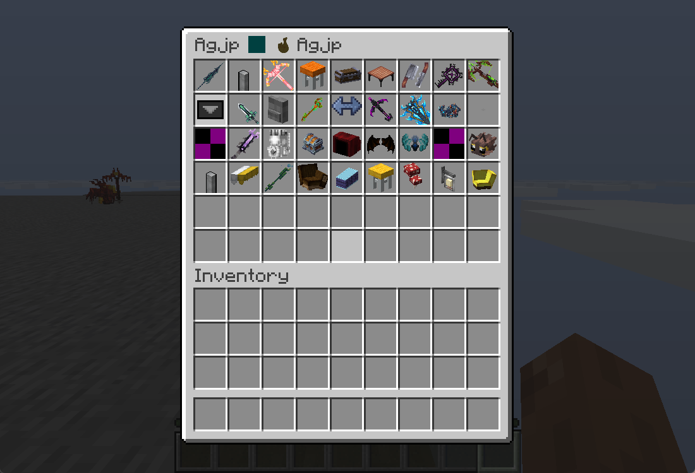
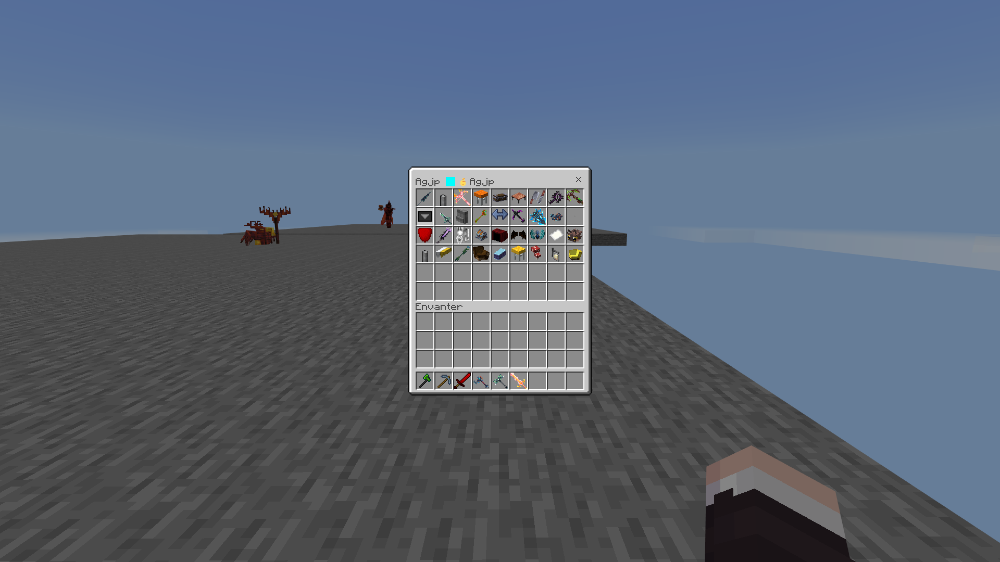
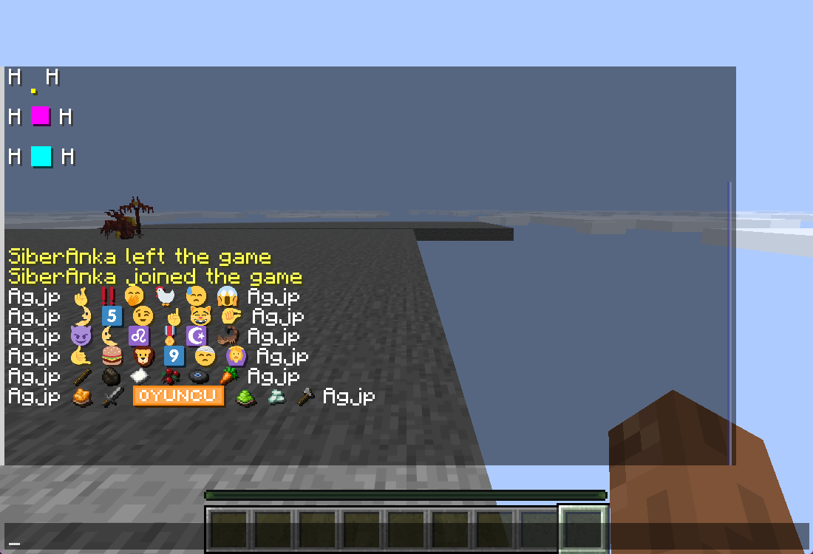
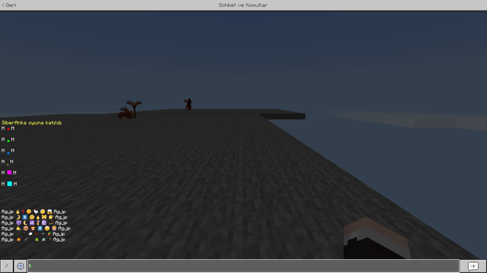
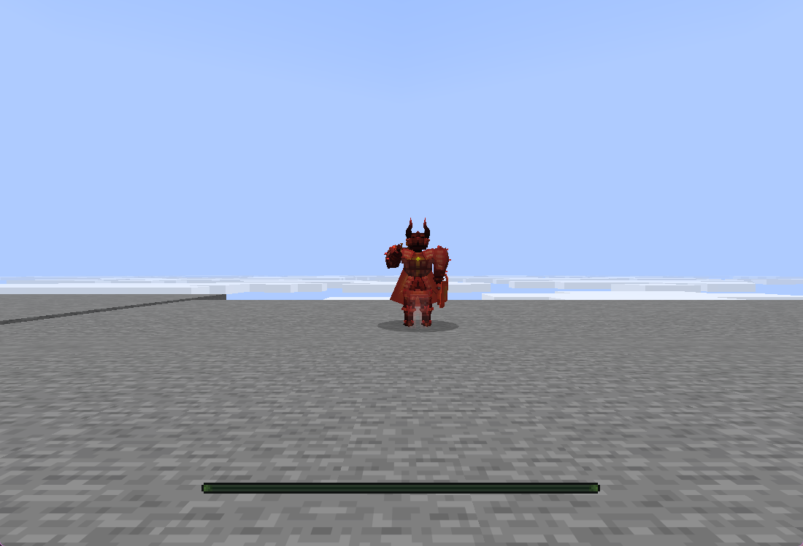
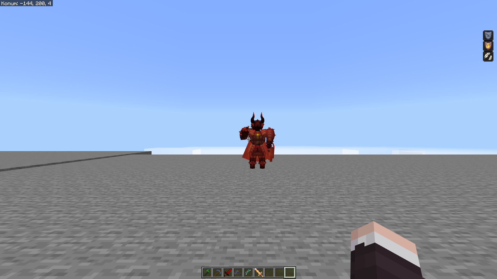

# Twilight

[](LICENSE.LESSER)
[](#requirements)

Twilight is a server-side Java-to-Bedrock custom-content compiler for Geyser. It discovers content generated by server plugins and datapacks, converts supported Java item assets into a Bedrock resource pack, writes Geyser custom mappings, validates the result, and can deploy it transactionally. Players do not install a client mod.

The current capability matrix and version-specific limitations are documented in [docs/COMPATIBILITY.md](docs/COMPATIBILITY.md). Strict conversion fails closed when content cannot be represented safely.

## Visual acceptance tests

The [real-content review](docs/REAL_CONTENT_REVIEW.md) records six tools/weapons, chat emoji, two GUI font probes, and sampled BetterModel/ModelEngine poses, including remaining failures and blocked checks. The locally built [1.0.0-pre.3 prerelease JAR and checksum](artifacts/) accompany the source. Full visual parity is not established.

The [cloud-anchor regression](docs/CLOUD_ANCHORS_2026-09-29.md) verifies automatic removal of unwanted ModelEngine particles, live state changes and passenger retention. The [mount-height regression](docs/DISPLAY_SEATS_2026-09-29.md) corrects the tested basket's lighting on solid ground. Full pose and material parity remain open.

The [extended content checks](docs/BROAD_CONTENT_2026-09-29.md) cover 911 discovered
item candidates, six further held items, 28 chat glyphs and Survival menu images.
They document a corrected overlay-name blocker and remaining conversion failures.

The [new-sample regression](docs/COMPOSITE_MODELS_2026-09-30.md) expands testing
with 36 different items, 24 emoji and four further models. It identifies and
corrects lost per-child composite transforms; remaining visual gaps are recorded.

The [font metrics regression](docs/FONT_METRICS_2026-10-01.md) measures Java/Bedrock
glyph placement and corrects height/ascent conversion without page-relative heuristics.

The latest reviewed captures below show the 1 October font/menu checks and the
30 September composite regression. GUI scales differ between clients. The menu
pair verifies glyph placement and inventory previews; title tint, two invalid
Java source references, wide tags and full UI backgrounds remain limitations.
See the linked reports for build hashes and per-sample results.

<table>
  <tr><th>Java inventory and glyph title - 1 October</th><th>Bedrock inventory and glyph title - 1 October</th></tr>
  <tr>
    <td></td>
    <td></td>
  </tr>
  <tr><th>Java real glyphs - 1 October</th><th>Bedrock real glyphs - 1 October</th></tr>
  <tr>
    <td></td>
    <td></td>
  </tr>
  <tr><th>Java composite model - 30 September</th><th>Bedrock composite model - 30 September</th></tr>
  <tr>
    <td></td>
    <td></td>
  </tr>
</table>

## Requirements

- Java 21 or newer
- Spigot, Paper, or Folia 1.21.4 or newer
- Geyser with custom content enabled for generated mappings and packs

The release artifact is one server plugin: `Twilight.jar`. Fabric client support has ended.

## Discovery and automation

Twilight resolves `level-name` from `server.properties`, active Bukkit worlds, their datapacks, and generated content under supported provider directories. Current discovery recognizes ItemsAdder, CraftEngine, Nexo, Oraxen, BetterModel, ModelEngine, RealisticSeasons, and explicitly configured pack sources. Provider `contents`/`resources`, `data`, and `cache` metadata and asset roots are indexed in that order of authority; generated ZIPs remain the lower-priority fallback for files absent from those roots. Standard assets remain the source of truth, so compatible providers can work through the file and Bukkit APIs without vendor-specific conversion code.

The runtime collector inspects recipe results, online player inventories, modern `minecraft:item_model` components, legacy custom model data, and public ItemsAdder, CraftEngine, Nexo, and Oraxen item registries when available. Supported provider load, reload, and pack-generation events plus content-changing commands trigger a debounced conversion and delayed settle check. File discovery remains available when an API shape changes.

## Installation

1. Put `Twilight.jar` in the server's `plugins` directory.
2. Start the server once and review `plugins/Twilight/config.yml`.
3. Keep `vanilla-override: false` unless replacing vanilla presentation is intentional.
4. Run `/twilight scan`, then `/twilight convert`.
5. Review `plugins/Twilight/reports`, `plugins/Twilight/logs`, and `plugins/Twilight/build/current`.

With default automation enabled, Twilight performs a delayed conversion after server/provider loading, deploys a validated build to the local Geyser directory, and reports a required server restart when item mappings differ from the startup set. `/geyser reload` cannot rebuild the item registry; unchanged mappings permit a controlled resource reload. A failed strict build never replaces the last known-good output.

## Commands

| Command | Purpose |
|---|---|
| `/twilight status` | Show operation, scan, Geyser, and backup state. |
| `/twilight scan` | Discover and inspect sources without converting. |
| `/twilight convert` | Scan, convert, validate, and optionally deploy. `/twilight build` is an alias. |
| `/twilight deploy` | Deploy the current validated output to Geyser. |
| `/twilight rollback [index]` | Restore a retained Geyser deployment snapshot. |
| `/twilight reload` | Reload and validate Twilight configuration. |

Each operation writes a dedicated UTF-8 log under `plugins/Twilight/logs`, for example `convert-log-20260921-153000-000-a1b2c3d4.txt`. Logs include phases, selected sources, counts, isolated conversion problems, the executing thread, and complete stack traces.

## Conversion and safety contract

- Modern Java item-definition trees support plain models, conditions, range dispatch, selects, static composites, and special-model bases where Geyser has an equivalent predicate.
- Legacy numeric custom-model-data overrides remain supported.
- Animated item textures currently export the first authored frame. Full `.mcmeta` animation playback is not implemented.
- Layered 2D textures are composed without smoothing. Java cuboids remain volumetric Bedrock geometry with separate first/third-person left/right and head transforms. Handheld presentation follows the resolved Java model parent, while authored hand translation, rotation, and scale are preserved without implicit fitting.
- Single-layer texture-only bows and crossbows reuse Bedrock's native pose, pull geometry, and animation controllers. Volumetric legacy pull stages retain separate Java geometry and display transforms behind one runtime-selected Bedrock attachable. Crossbow arrow/rocket loads and fishing-rod cast models become explicit Geyser predicates, preserving their distinct states.
- Supported bitmap providers are converted into fixed 16-pixel-cell Bedrock Unicode pages with measured Java height/ascent alignment. Oversized GUI glyphs and custom spacing require a Bedrock layout adapter and fail strict conversion; diagnostic builds report and omit them. Six measured probe heights/baselines and 35 real glyphs were verified in both clients; contextual tint and full layout parity remain open. Named fonts contribute only globally safe, collision-free BMP private-use glyphs.
- With `vanilla-override: false`, normal Unicode cells in the Java default font cannot replace Bedrock's vanilla glyphs. Named-font cells that need contextual remapping or collide globally stop strict publication instead of corrupting menus or chat.
- Explicit `minecraft:` texture references missing from a custom pack can be resolved from a version-matched Mojang client JAR cached under `plugins/Twilight/cache`. Manifest metadata, size, and SHA-1 are verified before use; this never registers vanilla models as custom content.
- Layered Java `sounds.json` registries, file/event references, OGG assets, weights, pitch, volume, streaming, and attenuation are converted to Bedrock sound definitions. Explicit vanilla sound dependencies use the same version-matched, hash-verified Mojang asset chain.
- Vanilla items without a custom definition are never registered. `vanilla-override` defaults to `false`.
- ZIP traversal, symbolic source entries, oversized sources, malformed output JSON, empty archives, duplicate deployment targets, and hash mismatches stop publication.
- Builds use staging plus last-known-good replacement. Geyser deployment stages and hashes every owned file, rolls back on failure, leaves unrelated Geyser files untouched, and retains the newest three snapshots by default.
- Generated archive ordering and timestamps are normalized for repeatable output.

## API and events

Other plugins can obtain the non-blocking Bukkit service:

```java
TwilightApi twilight = Bukkit.getServicesManager().load(TwilightApi.class);
if (twilight != null && !twilight.isOperationRunning()) {
    twilight.requestConvert();
}
```

Twilight fires `TwilightScanCompleteEvent`, `TwilightBuildCompleteEvent`, `TwilightDeployCompleteEvent`, and `TwilightOperationFailedEvent` on the server scheduler. The failure event includes the per-operation log path and original exception.

## Building and local validation

```powershell
$env:JAVA_HOME='<path-to-jdk-25>'
$env:GRADLE_OPTS='-Djavax.net.ssl.trustStoreType=Windows-ROOT'
.\gradlew.bat :twilight:build --no-daemon --no-configuration-cache
```

The JAR is written to `twilight/build/libs/Twilight.jar`. Hosted builds are manual-only; pushes do not trigger GitHub Actions.

If Geyser rejects valid mapping type `definition` under a Turkish/Azeri JVM locale, start the server with `-Duser.language=en -Duser.country=US`. Twilight warns about this case without changing the global JVM locale.

## License

Twilight is maintained by `siberanka` and licensed under LGPL-3.0-or-later. Provider names belong to their respective owners and indicate compatibility targets, not affiliation.
