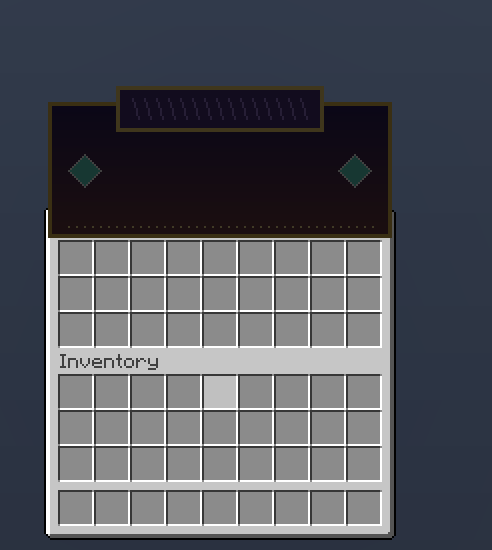
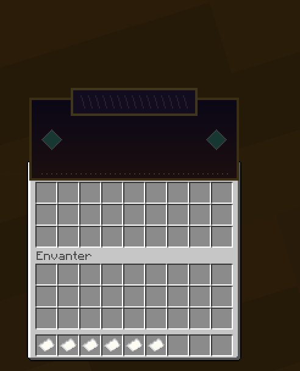
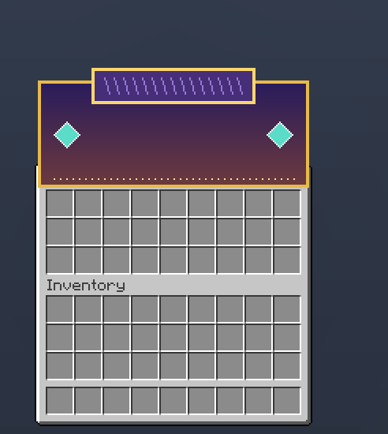
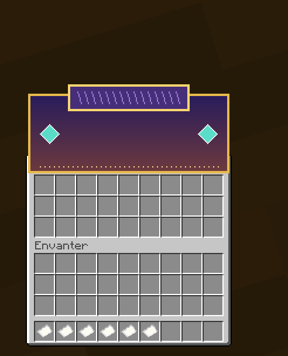
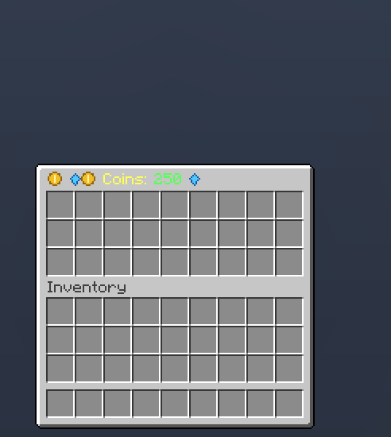
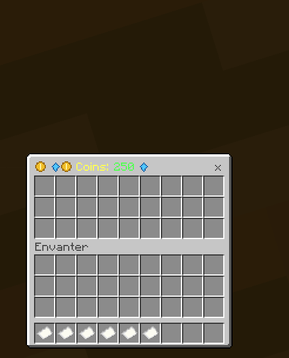
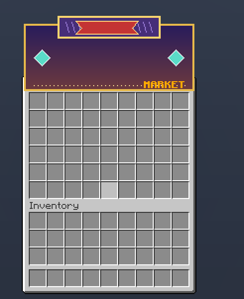
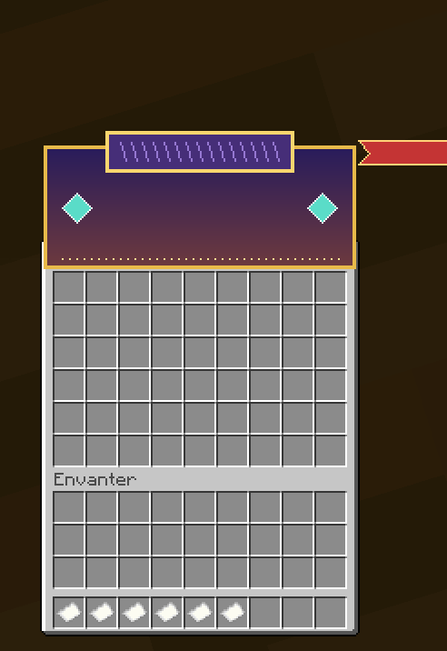
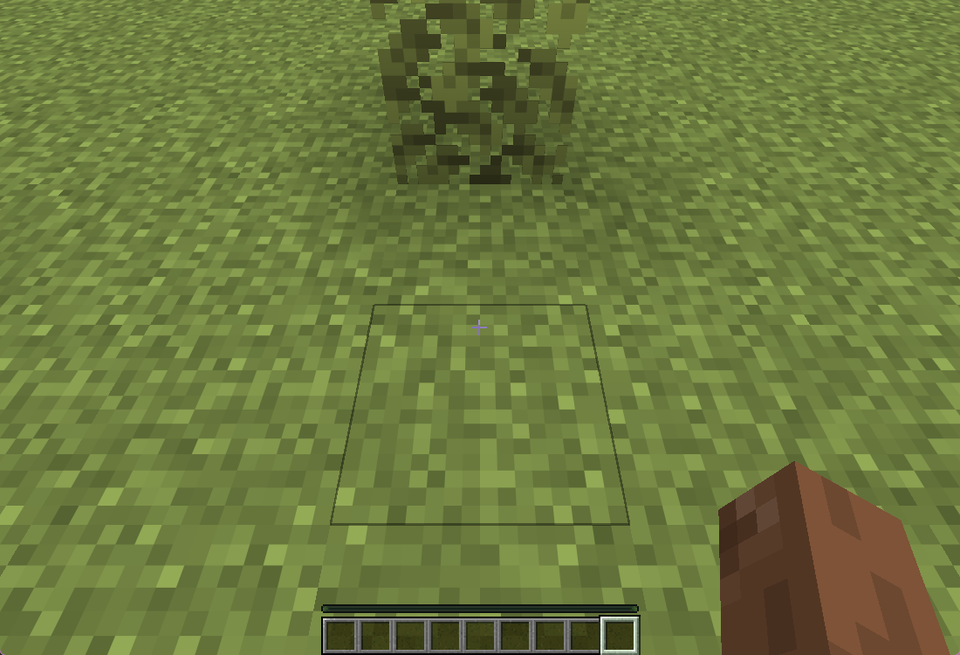
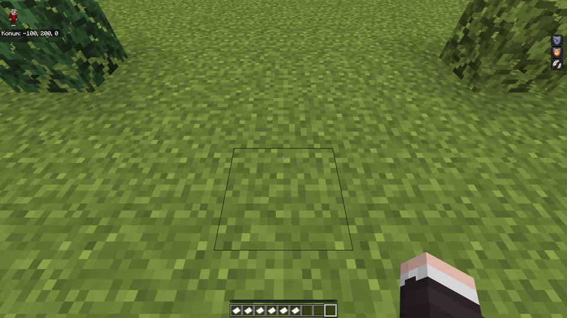

# Twilight

[](LICENSE.LESSER)
[](#requirements)

Twilight is a server-side Java-to-Bedrock custom-content compiler for Geyser. It discovers content generated by server plugins and datapacks, converts supported Java item assets into a Bedrock resource pack, writes Geyser custom mappings, validates the result, and can deploy it transactionally. Players do not install a client mod.

The current capability matrix and version-specific limitations are documented in [docs/COMPATIBILITY.md](docs/COMPATIBILITY.md). Strict conversion fails closed when content cannot be represented safely.

The [expanded acceptance contract](docs/COMPATIBILITY_REVIEW_2026-10-03.md)
tracks 40 areas and 289 required scenarios, including menus, tooltips and live
HUDs. These are acceptance obligations, not a count of passing tests.

## Visual acceptance tests

The [UI campaign](docs/UI_CAMPAIGN_2026-10-04.md) opened 104 real menus of two
servers on Java and Bedrock: every window and 97 title bands match Java; the rest
are differences of Bedrock's own text font. An original-art style suite covers the
same menu techniques with publishable captures, including titles Java darkens and
layered titles, which are not reproduced yet. The same report covers complete
builds of six real servers and custom datapack biomes. The locally built
[1.0.0-pre.7 JAR and checksum](artifacts/) accompany the source. Full visual parity
is not established.

All screenshots below were captured on 4 October 2026 with the release build. Older
reports keep their measurements:
[real content](docs/REAL_CONTENT_REVIEW.md),
[cloud anchors](docs/CLOUD_ANCHORS_2026-09-29.md),
[mount heights](docs/DISPLAY_SEATS_2026-09-29.md),
[extended content](docs/BROAD_CONTENT_2026-09-29.md),
[composite models](docs/COMPOSITE_MODELS_2026-09-30.md),
[font metrics](docs/FONT_METRICS_2026-10-01.md),
[wide glyphs](docs/WIDE_GLYPHS_2026-10-02.md),
[container layout](docs/CONTAINER_LAYOUT_2026-10-03.md),
[text layout](docs/TEXT_LAYOUT_2026-10-03.md) and
[text surfaces](docs/TEXT_SURFACES_2026-10-04.md).

<table>
  <tr><th>Java - menu title without a colour</th><th>Bedrock</th></tr>
  <tr>
    <td></td>
    <td></td>
  </tr>
  <tr><th>Java - white title</th><th>Bedrock</th></tr>
  <tr>
    <td></td>
    <td></td>
  </tr>
  <tr><th>Java - icons, spaces and text</th><th>Bedrock</th></tr>
  <tr>
    <td></td>
    <td></td>
  </tr>
  <tr><th>Java - layered title</th><th>Bedrock - not reproduced yet</th></tr>
  <tr>
    <td></td>
    <td></td>
  </tr>
  <tr><th>Java - datapack biome</th><th>Bedrock - closest vanilla biome</th></tr>
  <tr>
    <td></td>
    <td></td>
  </tr>
</table>

## Requirements

- Java 21 or newer
- Spigot, Paper, or Folia 1.21.4 or newer
- Geyser with custom content enabled for generated mappings and packs

The release artifact is one server plugin: `Twilight.jar`. Fabric client support has ended.

## Discovery and automation

Twilight resolves `level-name` from `server.properties`, active Bukkit worlds, their datapacks, and generated content under supported provider directories. Current discovery recognizes ItemsAdder, CraftEngine, Nexo, Oraxen, BetterModel, ModelEngine, RealisticSeasons, and explicitly configured pack sources. Provider `contents`/`resources`, `data`, and `cache` metadata and asset roots are indexed in that order of authority; generated ZIPs remain the lower-priority fallback for files absent from those roots. Copies of the vanilla client assets, temporary build folders and stale packs nested in a provider's working folder are ignored; a renamed ItemsAdder output pack is used when `generated.zip` is absent. Standard assets remain the source of truth, so compatible providers can work through the file and Bukkit APIs without vendor-specific conversion code.

The runtime collector inspects recipe results, online player inventories, modern `minecraft:item_model` components, legacy custom model data, and public ItemsAdder, CraftEngine, Nexo, and Oraxen item registries when available. Supported provider load, reload, and pack-generation events plus content-changing commands trigger a debounced conversion and delayed settle check. File discovery remains available when an API shape changes.

## Installation

1. Put `Twilight.jar` in the server's `plugins` directory.
2. Start the server once and review `plugins/Twilight/config.yml`.
3. Keep `vanilla-override: false` unless replacing vanilla presentation is intentional.
4. Run `/twilight scan`, then `/twilight convert`.
5. Review `plugins/Twilight/reports`, `plugins/Twilight/logs`, and `plugins/Twilight/build/current`.

With default automation enabled, Twilight performs a delayed conversion after server/provider loading, deploys a validated build to the local Geyser directory, and reports a required server restart when item mappings differ from the startup set. `/geyser reload` cannot rebuild the item registry; unchanged mappings permit a controlled resource reload. A failed strict build never replaces the last known-good output.

## Commands

| Command | Purpose |
|---|---|
| `/twilight status` | Show operation, scan, Geyser, and backup state. |
| `/twilight scan` | Discover and inspect sources without converting. |
| `/twilight convert` | Scan, convert, validate, and optionally deploy. `/twilight build` is an alias. |
| `/twilight deploy` | Deploy the current validated output to Geyser. |
| `/twilight rollback [index]` | Restore a retained Geyser deployment snapshot. |
| `/twilight reload` | Reload and validate Twilight configuration. |

Each operation writes a dedicated UTF-8 log under `plugins/Twilight/logs`, for example `convert-log-20260921-153000-000-a1b2c3d4.txt`. Logs include phases, selected sources, counts, isolated conversion problems, the executing thread, and complete stack traces.

## Conversion and safety contract

- Modern Java item-definition trees support plain models, conditions, range dispatch, selects, static composites, and special-model bases where Geyser has an equivalent predicate.
- Legacy numeric custom-model-data overrides remain supported.
- Animated item textures currently export the first authored frame. Full `.mcmeta` animation playback is not implemented.
- Layered 2D textures are composed without smoothing. Java cuboids remain volumetric Bedrock geometry with separate first/third-person left/right and head transforms. Handheld presentation follows the resolved Java model parent, while authored hand translation, rotation, and scale are preserved without implicit fitting.
- Single-layer texture-only bows and crossbows reuse Bedrock's native pose, pull geometry, and animation controllers. Volumetric legacy pull stages retain separate Java geometry and display transforms behind one runtime-selected Bedrock attachable. Crossbow arrow/rocket loads and fishing-rod cast models become explicit Geyser predicates, preserving their distinct states.
- Supported bitmap providers use adaptive 16-to-512-pixel cells with measured Java height/ascent alignment. Atlas growth preserves authored display dimensions; overflow beyond the supported bounds and custom spacing fail strict conversion. Six metric probes, 36 real glyphs and six further UI/HUD images were compared in both clients. Chest titles use Java font metrics (spacing, negative shifts, bearings and remapped characters); fractional sampling remains a limitation. Large atlases also increase memory use; see the wide glyph review. Named fonts contribute only globally safe, collision-free BMP private-use glyphs.
- Text is laid out for Bedrock players with Java font metrics (`ui.java-text-layout: true`): fonts from all packs are combined like Java, spacing and negative-shift characters become invisible spacers, and characters Java remaps or named fonts use receive private-use aliases. Chest titles, chat, action bar, titles, boss bars, scoreboards, entity names and text displays are covered (`ui.java-text-surfaces: true`); item names and lore are not. Titles without a colour show their images darkened like Java (`ui.java-glyph-tint: true`), and the packs' translations reach Bedrock players (`ui.java-translations: true`). A glyph directly after text without a space can still differ by a unit, and layers moved back over an earlier image are not reproduced.
- Datapack and plugin biomes are shown on Bedrock as the vanilla biome with the closest grass, foliage, water and fog colours instead of Geyser's ocean fallback (`world.bedrock-biome-matching: true`).
- Desktop chest screens receive Java's container layout (`ui.java-container-layout: true`): unwrapped titles, Java label positions and drawing order, and Java slot spacing for 1 to 6 rows. Twilight merges partial UI definitions instead of replacing Bedrock UI files; other containers and touch layouts stay vanilla.
- With `vanilla-override: false`, normal Unicode cells in the Java default font never replace Bedrock's vanilla glyphs; the text layout gives them private-use aliases instead. Characters drawn from Java's own font sheets stay ordinary Bedrock text.
- Texture atlas sprite renames (for example ItemsAdder's `ia:<number>` sprites) and protected PNGs with broken checksums are resolved like Java. Faces whose texture variable no model defines use Java's missing texture. Content Java rejects as well is reported as a notice in `build-report.json` instead of stopping a strict build.
- Explicit `minecraft:` texture references missing from a custom pack can be resolved from a version-matched Mojang client JAR cached under `plugins/Twilight/cache`. Manifest metadata, size, and SHA-1 are verified before use; this never registers vanilla models as custom content.
- Layered Java `sounds.json` registries, file/event references, OGG assets, weights, pitch, volume, streaming, and attenuation are converted to Bedrock sound definitions. Explicit vanilla sound dependencies use the same version-matched, hash-verified Mojang asset chain.
- Vanilla items without a custom definition are never registered. `vanilla-override` defaults to `false`.
- ZIP traversal, symbolic source entries, oversized sources, malformed output JSON, empty archives, duplicate deployment targets, and hash mismatches stop publication.
- Builds use staging plus last-known-good replacement. Geyser deployment stages and hashes every owned file, rolls back on failure, leaves unrelated Geyser files untouched, and retains the newest three snapshots by default.
- Generated archive ordering and timestamps are normalized for repeatable output.

## API and events

Other plugins can obtain the non-blocking Bukkit service:

```java
TwilightApi twilight = Bukkit.getServicesManager().load(TwilightApi.class);
if (twilight != null && !twilight.isOperationRunning()) {
    twilight.requestConvert();
}
```

Twilight fires `TwilightScanCompleteEvent`, `TwilightBuildCompleteEvent`, `TwilightDeployCompleteEvent`, and `TwilightOperationFailedEvent` on the server scheduler. The failure event includes the per-operation log path and original exception.

## Building and local validation

```powershell
$env:JAVA_HOME='<path-to-jdk-25>'
$env:GRADLE_OPTS='-Djavax.net.ssl.trustStoreType=Windows-ROOT'
.\gradlew.bat :twilight:build --no-daemon --no-configuration-cache
```

The JAR is written to `twilight/build/libs/Twilight.jar`. Hosted builds are manual-only; pushes do not trigger GitHub Actions.

If Geyser rejects valid mapping type `definition` under a Turkish/Azeri JVM locale, start the server with `-Duser.language=en -Duser.country=US`. Twilight warns about this case without changing the global JVM locale.

## License

Twilight is maintained by `siberanka` and licensed under LGPL-3.0-or-later. Provider names belong to their respective owners and indicate compatibility targets, not affiliation.
