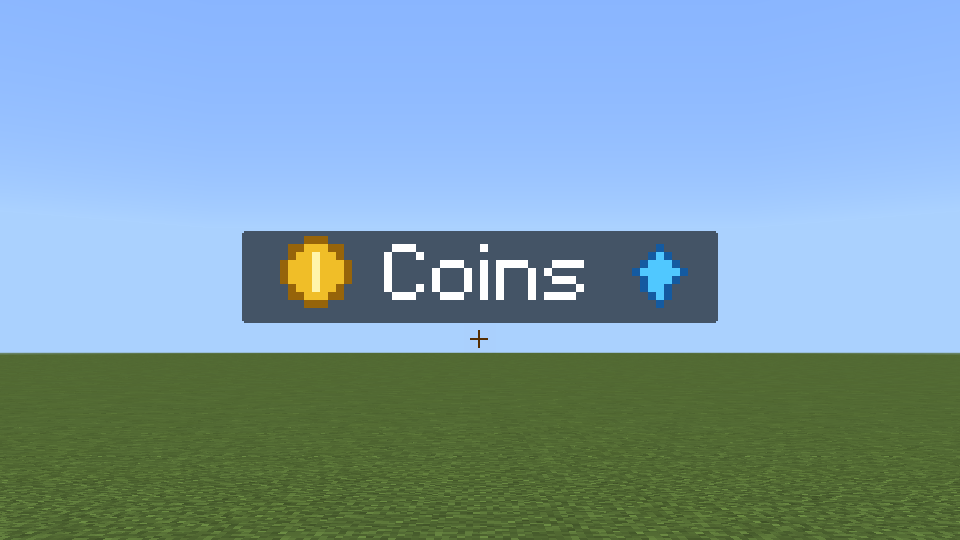

# twilight-proxy live test - 5 October 2026

> Türkçe: [aşağıda](#türkçe)

twilight-proxy 1.0.0-pre.9 was tested on Velocity 4.2.0 and on BungeeCord 26.1 (build 2102), each
with Geyser 2.11.3 (build 1248) on the proxy, two isolated Paper 26.2 backends and the Bedrock
1.26.5203.0 client. Production servers were not involved.

| Backend | Pack source | Content |
|---|---|---|
| `lobby` | `auto` | Twilight's build of the test server (126 items, 2,242 KiB) |
| `survival` | `survival.zip` in `packs/` | the original-art style suite (icons, 18 KiB) |

## Results

| Step | Velocity 4.2.0 (modern forwarding) | BungeeCord 26.1 (explicit secret) |
|---|---|---|
| Secret | found in `forwarding.secret` on the proxy and in `paper-global.yml` on the backend | `secret` / `proxy.secret` |
| Bedrock joins `lobby` | connected | connected |
| `lobby` pack over plugin messages | received 6 s after the join, SHA-256 identical to the backend's export | received 7 s after the join, identical |
| `send <player> survival` | client transferred, rejoined and routed to `survival` 5 s later | the same, 5 s |
| `send <player> lobby` | transferred, rejoined, routed to `lobby` 5 s later | the same, 5 s |
| Second join with the same packs | no transfer | no transfer |

The first download of a pack Bedrock has not cached shows Bedrock's own download prompt; after
it, the client keeps the pack and later switches reconnect without a prompt. On `survival` the
pack's icons rendered in a title sent by the backend:

## Defects found and fixed during the test

- A pending destination expired after 60 seconds, shorter than a player may take to accept the
  download prompt; it now lasts ten minutes.
- On BungeeCord the first server is chosen before Geyser knows the player's Java UUID, so the
  transferred player was sent to the default server. twilight-proxy now remembers the Java name of a
  transferred player and accepts it only when a Bedrock session of the same account has reconnected
  after the transfer.

## Automated checks

Seven tests cover the configuration (including unsafe file names, links with credentials, lists,
tabs and out-of-range numbers), pack checks (missing root manifest, entries escaping a folder,
size limit, non-ZIP files), signed messages (tampering, wrong keys, old timestamps, oversized and
truncated messages), a complete transfer, an out-of-order chunk that aborts a transfer and deletes
its partial file, and the discovery of Velocity's secret (a secret file outside the proxy folder is
ignored).

---

## Türkçe

### twilight-proxy canlı testi - 5 Ekim 2026

twilight-proxy 1.0.0-pre.9; Velocity 4.2.0 ve BungeeCord 26.1 (derleme 2102) üzerinde, her birinde proxy'de
Geyser 2.11.3 (derleme 1248), iki yalıtılmış Paper 26.2 arka ucu ve Bedrock 1.26.5203.0 istemcisiyle test
edildi. Üretim sunucuları kullanılmadı.

| Arka uç | Paket kaynağı | İçerik |
|---|---|---|
| `lobby` | `auto` | Twilight'ın test sunucusu için derlemesi (126 eşya, 2.242 KiB) |
| `survival` | `packs/` içindeki `survival.zip` | özgün görselli stil takımı (simgeler, 18 KiB) |

#### Sonuçlar

| Adım | Velocity 4.2.0 (modern yönlendirme) | BungeeCord 26.1 (açık gizli anahtar) |
|---|---|---|
| Gizli anahtar | proxy'de `forwarding.secret`, arka uçta `paper-global.yml` içinde bulundu | `secret` / `proxy.secret` |
| Bedrock `lobby`ye katılır | bağlandı | bağlandı |
| Eklenti mesajlarıyla `lobby` paketi | katılımdan 6 sn sonra alındı, SHA-256 arka ucun dışa aktarımıyla aynı | katılımdan 7 sn sonra alındı, aynı |
| `send <oyuncu> survival` | istemci aktarıldı, yeniden katıldı ve 5 sn sonra `survival`a yönlendirildi | aynısı, 5 sn |
| `send <oyuncu> lobby` | aktarıldı, yeniden katıldı, 5 sn sonra `lobby`ye yönlendirildi | aynısı, 5 sn |
| Aynı paketlerle ikinci katılım | aktarım yok | aktarım yok |

Bedrock'un önbelleğe almadığı bir paketin ilk indirmesi Bedrock'un kendi indirme sorusunu gösterir;
ardından istemci paketi saklar ve sonraki geçişler soru sormadan yeniden bağlanır. `survival` üzerinde
paketin simgeleri arka ucun gönderdiği bir başlıkta çizildi (görüntü yukarıdaki İngilizce bölümdedir).

#### Test sırasında bulunan ve düzeltilen hatalar

- Bekleyen bir hedef 60 saniye sonra sona eriyordu; bu, bir oyuncunun indirme sorusunu kabul etmesi için
  gereken süreden kısaydı; artık on dakika sürüyor.
- BungeeCord'da ilk sunucu, Geyser oyuncunun Java UUID'sini bilmeden önce seçilir; bu yüzden aktarılan
  oyuncu varsayılan sunucuya gönderiliyordu. twilight-proxy artık aktarılan oyuncunun Java adını hatırlar
  ve bunu yalnızca aynı hesabın bir Bedrock oturumu aktarımdan sonra yeniden bağlandığında kabul eder.

#### Otomatik denetimler

Yedi test şunları kapsar: yapılandırma (güvensiz dosya adları, kimlik bilgisi içeren bağlantılar, listeler,
sekmeler ve aralık dışı sayılar dahil), paket denetimleri (eksik kök manifest, klasör dışına çıkan girdiler,
boyut sınırı, ZIP olmayan dosyalar), imzalı mesajlar (kurcalama, yanlış anahtarlar, eski zaman damgaları,
aşırı büyük ve kesilmiş mesajlar), tam bir aktarım, aktarımı iptal edip kısmi dosyasını silen sıra dışı bir
parça ve Velocity gizli anahtarının keşfi (proxy klasörü dışındaki bir gizli anahtar dosyası yok sayılır).
