# Real-content visual review — 2026-09-27

Twilight 1.0.0-pre.3 was tested with real tools, weapons, emoji, and menu images
from the operator's BoxPVP-v2 and Survival-v5 installations. Survival-v3 was not
present. The operator authorized publication of the reviewed screenshots below.
Source packs, plugin binaries, configuration, worlds, and raw logs remain private.

**Result: partial improvements, not full Java/Bedrock parity.** Third-person
volumetric geometry improved, but first-person framing, observer presentation,
and chat/UI acceptance remain open. Large Java GUI glyphs need a Bedrock layout
adapter and are now explicitly rejected in strict conversion.

## Method and environment

- Paper 26.2 build 121; Java client 26.2; Java 25.0.2; Geyser 2.11.3 build 1247;
  installed Bedrock client 26.52.
- Geyser's published support range ended at 26.51 during this run. This limits
  acceptance confidence; it does not prove the cause of every observed failure.
- Original Java model, display, texture, and animation metadata bytes were copied
  unchanged and checked against private source SHA-256 records. Only private test
  item associations and required atlas registrations were added.
- Repeatable random selection used seed `20260927`, with three flat BoxPVP items
  and three volumetric Survival items. Both clients selected the six hotbar slots.
- The server ran locally, with vanilla overrides disabled. Test players stayed in
  creative mode; model probes used stationary, invulnerable, non-attacking pigs.
- Changed item mappings were activated by a full server restart. The Turkish JVM
  locale caused Geyser to reject `definition`; isolated en/US JVM flags resolved it.
- All screenshots are actual client captures. Different skins, view sizes, and
  observer states prevent pixel-for-pixel comparison. In Bedrock third-person
  images, the red character on the right is the local player under test.

See [Geyser mapping installation](https://geysermc.org/wiki/geyser/custom-items/)
and [supported versions](https://geysermc.org/wiki/geyser/supported-versions/).

## Six item probes

The diagnostic pack converted 6/6 items, including three volumetric models, and
20 emoji into three font pages. It explicitly omitted two unsupported GUI glyphs.
Strict conversion rejected those GUI glyphs instead of publishing a degraded menu.

| Original model | Java reference | Bedrock final capture | Observation |
|---|---|---|---|
| `terraria:auto_generated/tin_axe` | [Java](images/acceptance/2026-09-27/java-box-axe-third.png) | [Bedrock](images/acceptance/2026-09-27/bedrock-final-box-axe-third.png) | Visible; edge-on holding direction is broadly similar, grip/scale parity unaccepted. |
| `itemsadder:auto_generated/spinel_pickaxe` | [Java](images/acceptance/2026-09-27/java-box-pickaxe-third.png) | [Bedrock](images/acceptance/2026-09-27/bedrock-final-box-pickaxe-third.png) | Visible; flat item pose and exact grip remain unaccepted. |
| `terraria:auto_generated/adamantite_sword` | [Java](images/acceptance/2026-09-27/java-box-sword-third.png) | [Bedrock](images/acceptance/2026-09-27/bedrock-final-box-sword-third.png) | Visible; exact pose/scale parity remains unaccepted. |
| `ender_dragonset:axe` | [Java](images/acceptance/2026-09-27/java-survival-axe-third.png) | [Bedrock](images/acceptance/2026-09-27/bedrock-final-survival-axe-third.png) | Local third-person silhouette and downward orientation broadly agree. Full multi-view acceptance remains open. |
| `mythic_weapons:pickaxe` | [Java](images/acceptance/2026-09-27/java-survival-pickaxe-third.png) | [Bedrock](images/acceptance/2026-09-27/bedrock-final-survival-pickaxe-third.png) | Broken/repeated texture segments improved; local third-person orientation broadly agrees. First-person differs. |
| `gearforge_nature:sword` | [Java](images/acceptance/2026-09-27/java-survival-sword-third.png) | [Bedrock](images/acceptance/2026-09-27/bedrock-final-survival-sword-third.png) | Local third-person silhouette broadly agrees; animation parity is not implemented. |

### Pickaxe texture correction

| Before final cuboid/UV/frame fixes | Final converted pack |
|---|---|
| 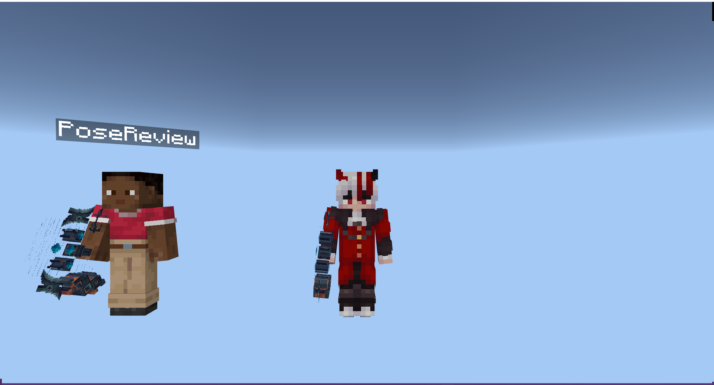 | 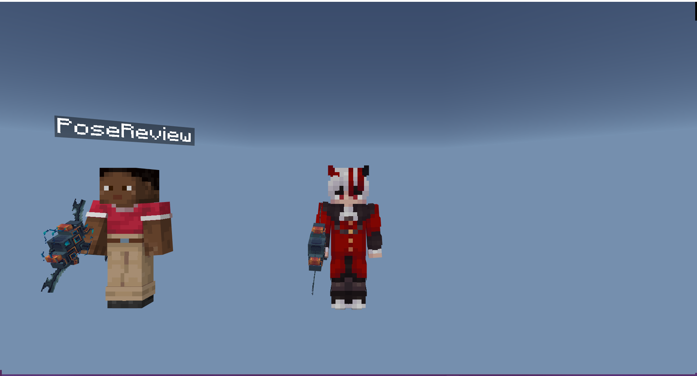 |

This fixes rotated element X/Y signs, face UV rotation, omitted Java UV defaults,
and static sampling of the first authored animation frame. Animated textures do
not yet play their complete Java animation. Remote equipment differed from the
local third-person pose, so observer presentation is still an open check.

### Remaining first-person mismatch

| Unchanged Java reference | Bedrock final pack — failed parity |
|---|---|
| 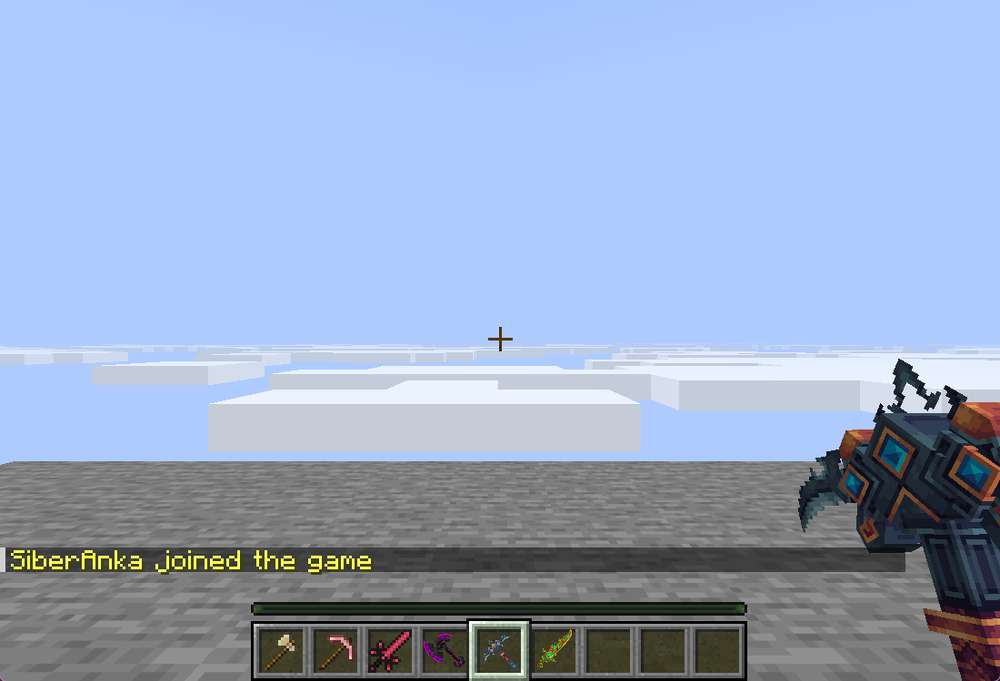 | 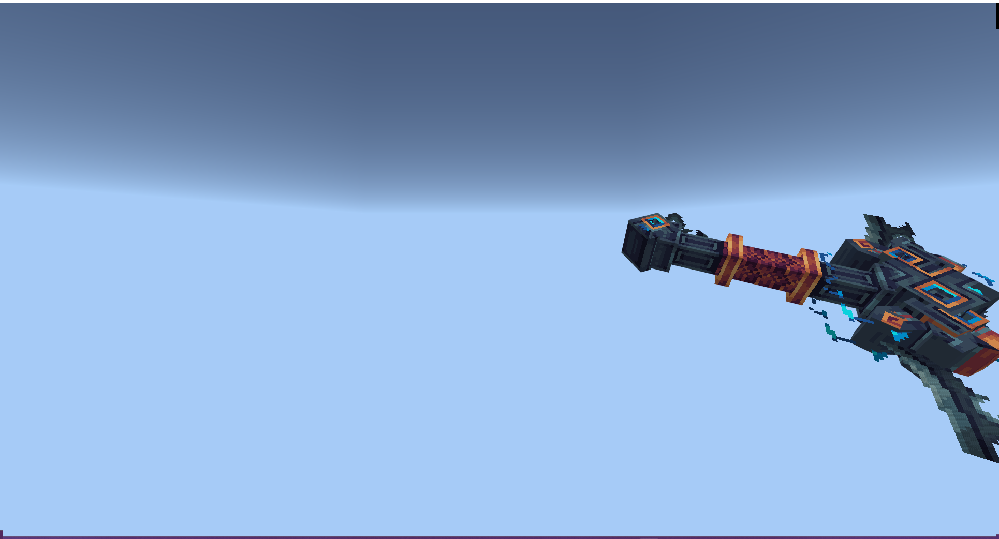 |

## Emoji and GUI probes

Four BoxPVP emoji and the Survival 4×4 emoji sheet were exported with original
code points. The Java chat probe uses `Agjp` on both sides to expose ascenders,
descenders, and baseline placement. Bedrock's chat and inventory UI did not
appear in this session, including after a fresh client launch and pack download.
Therefore inline emoji alignment is **blocked**, not passed.

| Java chat reference | Bedrock chat attempt — blocked |
|---|---|
| 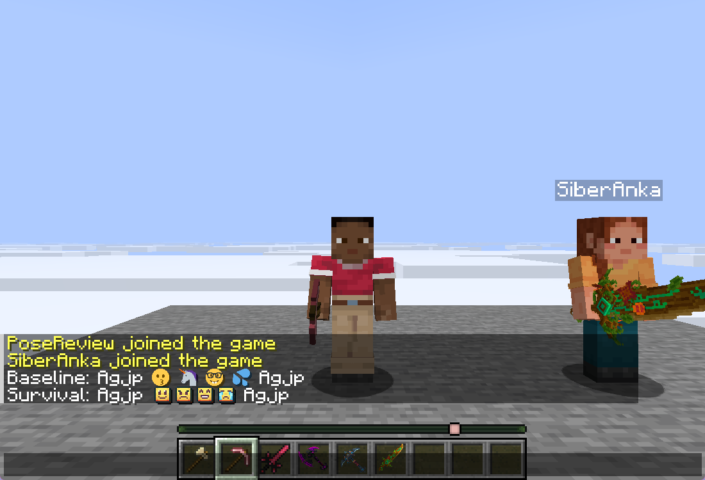 | 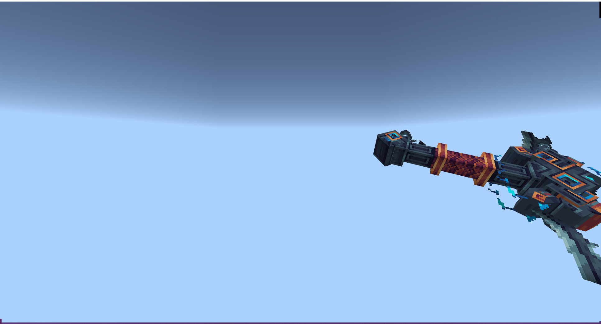 |

The menu probes put each original glyph in a plain 54-slot inventory title.
These are font-rendering probes, not complete production plugin menus: production
spacing, slot layout, and plugin behavior were not recreated. The large Java
images overlap the plain test inventory and must not be presented as a correct
production menu layout.

| BoxPVP blank-menu glyph | Survival lands-menu glyph |
|---|---|
| 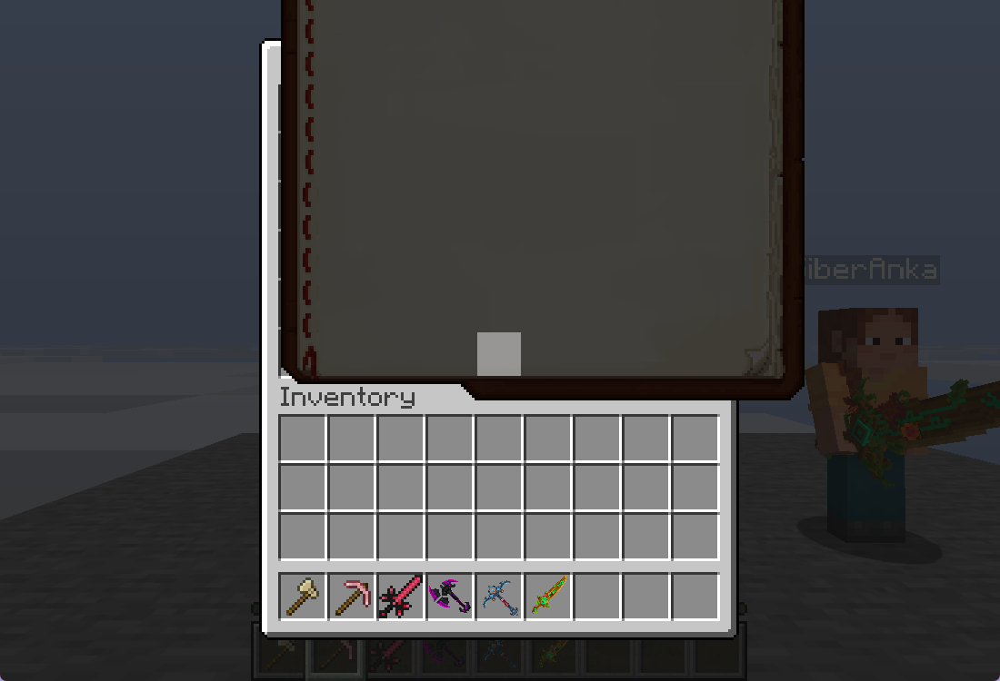 | 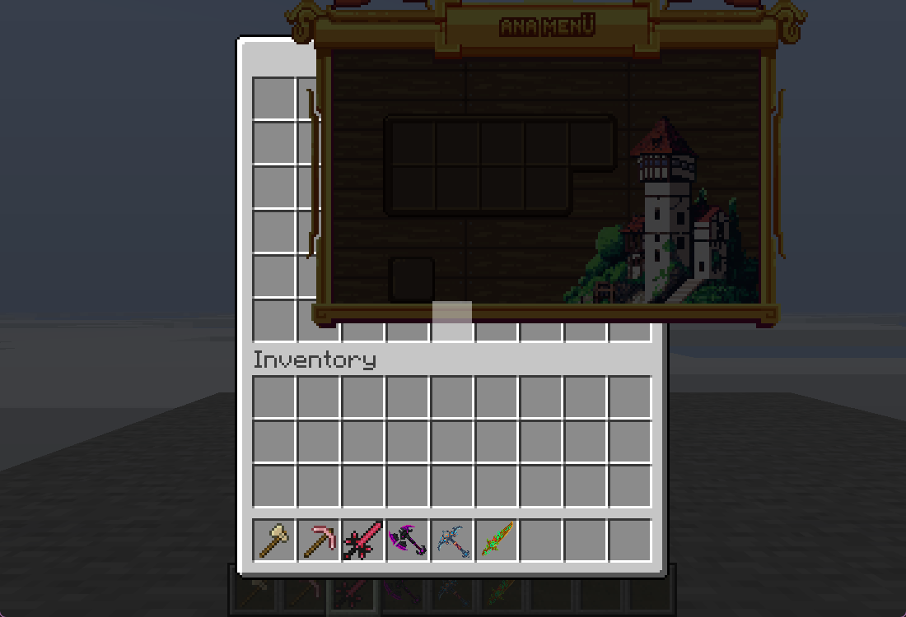 |

Their declared display sizes are 192×170 and 236×245, which cannot fit a Bedrock
16-pixel Unicode cell while retaining Java layout. Strict conversion now reports
`oversized bitmap glyphs require a Bedrock UI adapter`. Custom spacing also
requires a layout adapter. A [Bedrock inventory attempt](images/acceptance/2026-09-27/bedrock-final-ui-blocked.png)
showed no inventory UI; full GUI acceptance is unsupported/blocked.

## Live display bridge follow-up

A later development build adds a shared Bedrock entity and a Geyser item-display
translator. The original 34 BetterModel bone items now form an assembled model.
The test scene contains three stationary model instances (direct BetterModel and
MythicMobs integration), with 105 display entities in the Bedrock session.

| Java attack pose | Bedrock attack pose |
|---|---|
| 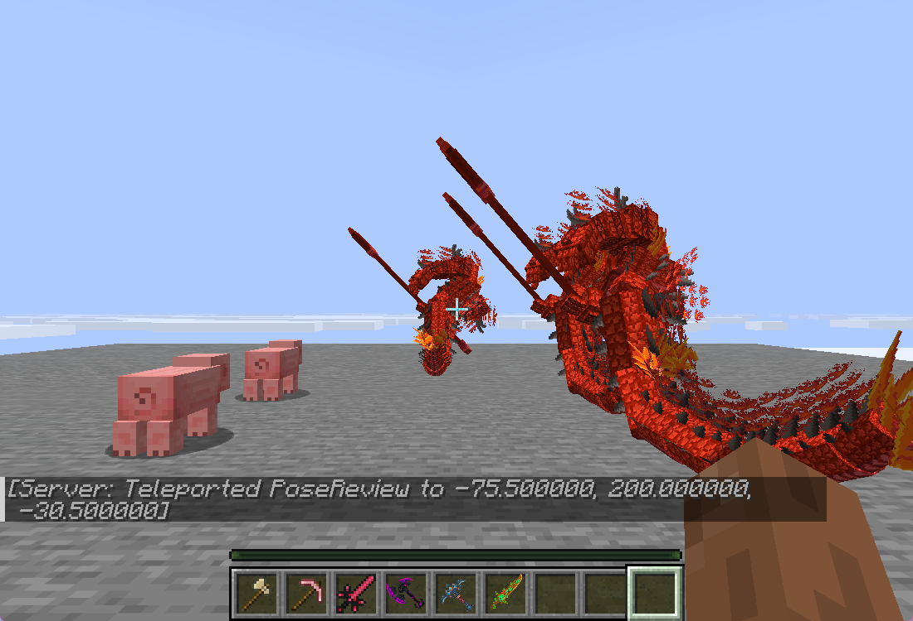 | 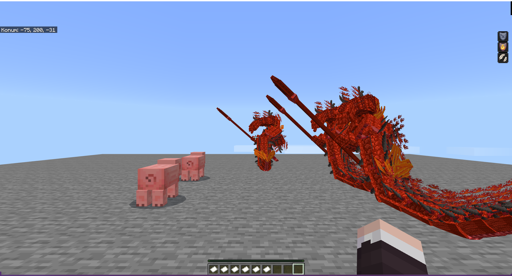 |

These are separate captures of the same looping animation, not synchronized
frames. Model assembly and attack movement are observed; exact timing, lighting,
all animation phases, and all provider models are not certified. The bridge uses
unchanged Java provider poses and independently generated Bedrock geometry.
See [bridge implementation and limits](DISPLAY_BRIDGE.md).

ModelEngine R4.1.1 subsequently enabled successfully on a separate local Paper
26.2 instance. Its generated salamander pack exposed an overlay-selection bug:
inactive older-version assets were being flattened into the current pack.
After selecting overlays by Minecraft's verified pack format and resolving
explicit vanilla texture references from the verified client cache, strict
conversion passed 70/70 offline definitions and 72/72 live-collected candidates
with no reported problems. The R4.1.0 result below remains historical.

The subsequent live ModelEngine probe exposed two independent display metadata
errors: base entity invisibility incorrectly hid visible Java display meshes,
and ignored zero view range exposed inactive fire layers. The bridge now follows
Java's visibility behavior for these cases. Two direct API models and one newly
spawned MythicMobs model appeared assembled in both clients after a full restart.
MythicMobs definitions were reloaded before the successful new spawn; earlier
control pigs without an attached model are not counted as passing model probes.

| Java, frozen ModelEngine attack | Bedrock, same frozen attack and camera position |
|---|---|
| 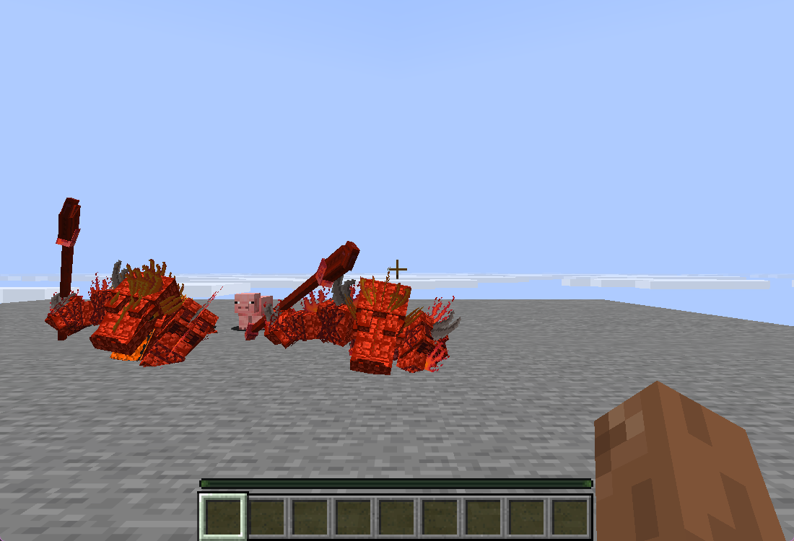 | 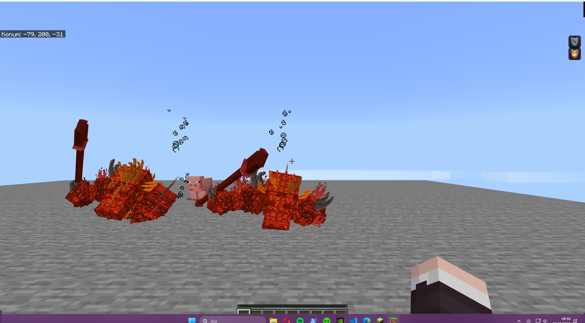 |

The provider animation clock was frozen at approximately 0.20 seconds for this
pose comparison. The low pose intersects the platform in both clients. Different
client field of view and lighting prevent a pixel-equality claim. This verifies
the sampled pose, not complete animation timing, fire animation, or tint parity.

| Java, MythicMobs with ModelEngine | Bedrock, same stationary MythicMobs carrier |
|---|---|
| 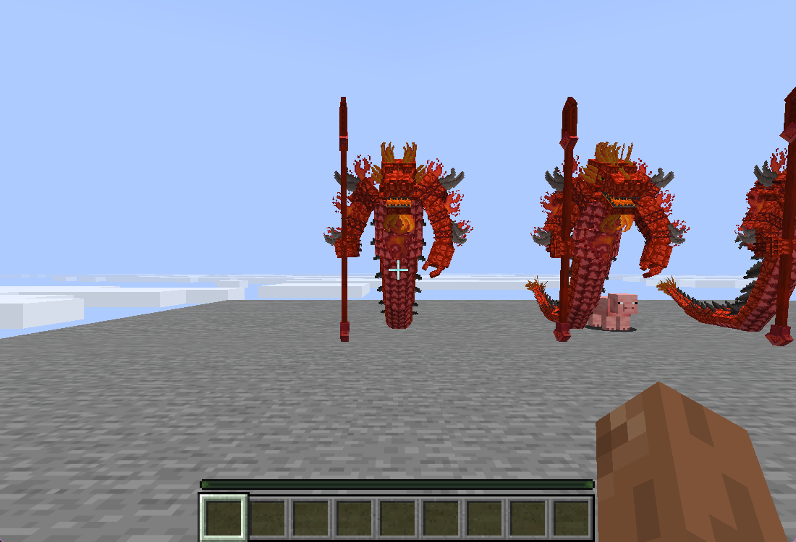 | 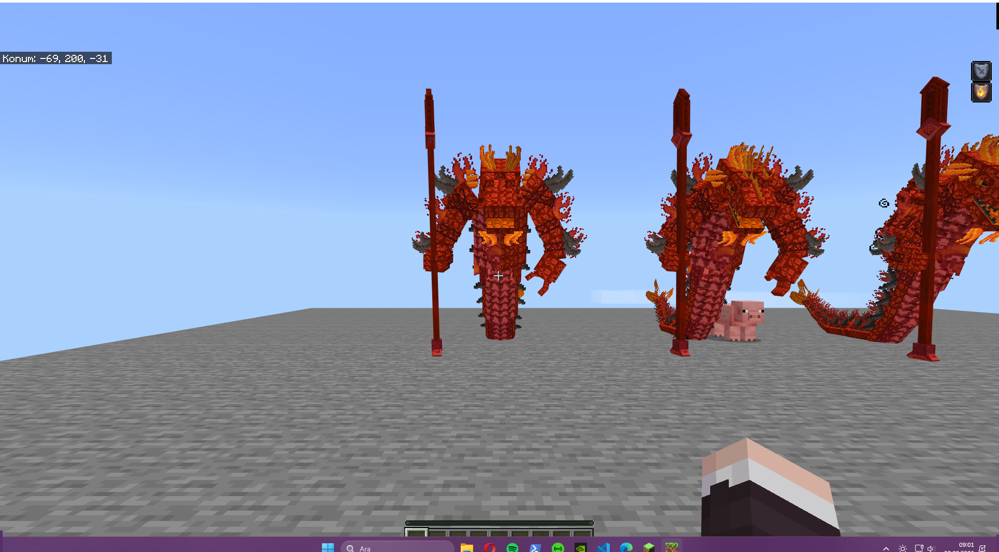 |

The front-facing centered model is the new MythicMobs spawn. Idle captures were
not synchronized to the same animation frame. All four saved test-player death
counters remained zero. These checks used invulnerable stationary carriers and
direct animation playback; production combat skills were not imported.

The earlier missing Bedrock HUD was no longer present after a later fresh join.
Earlier chat/UI failures therefore need a fresh content-specific retest; they
must not be attributed conclusively to the client/protocol version mismatch.

## Initial BetterModel, MythicMobs, and ModelEngine probes (before bridge)

| Probe | Java/server observation | Bedrock observation | Result |
|---|---|---|---|
| BetterModel 3.4.2-SNAPSHOT-516, original `meleesalamander` | Plugin enabled; direct spawn on a stationary pig displayed the model. | Assembled model absent after a full registry restart and fresh client join. | Failed entity parity. |
| MythicMobs 5.13.1-SNAPSHOT-88530541, stationary control pig | Spawn command succeeded; pig had no AI, zero damage, and invulnerability. | Control pigs visible. | Basic spawn/visibility observed; no combat/skills acceptance claim. |
| MythicMobs with BetterModel `model{mid=meleesalamander}` | Spawn command succeeded and the custom model appeared. | Custom salamander absent while control pigs remained visible. | Failed custom entity parity. |
| ModelEngine R4.1.0, local licensed JAR | Enable failed with `Unsupported NMS Version: 26.2`. | No functioning provider available for a spawn comparison. | Blocked by provider/server version. |

The BetterModel-generated resources were converted separately: **34/34 volumetric
bone items**, strict mode, zero reported problems. Geyser registered 35 custom
items, including its built-in item. The pack was downloaded by the Bedrock client.
This confirms item-resource conversion, not entity rig conversion. This initial result preceded the runtime bridge described above.

| Java stationary model/control scene | Bedrock after fresh join — custom models absent |
|---|---|
| 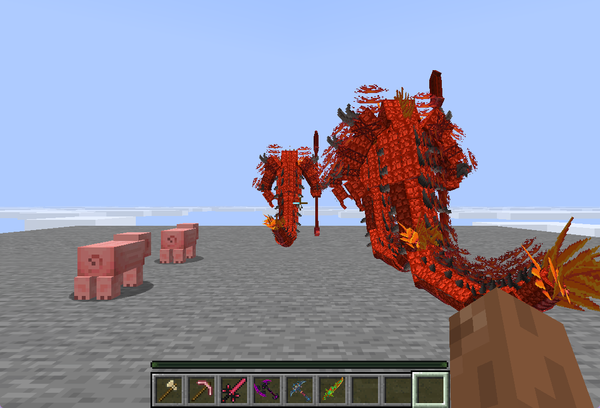 | 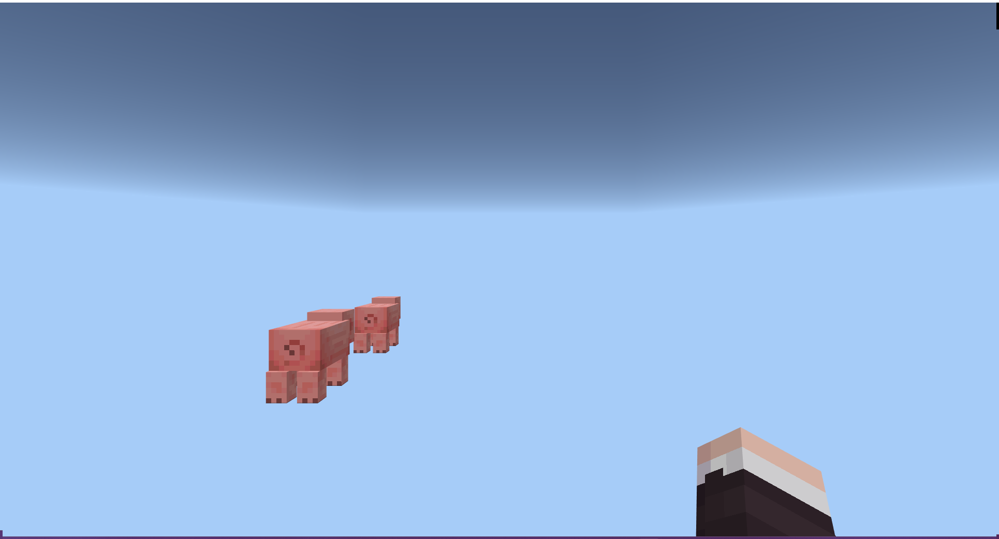 |

The camera positions differ slightly, but both face the stationary test area.
The two control pigs provide a visible scene reference. Both test players had
20/20 health and zero recorded deaths. Test mobs had AI disabled; no combat skills
were loaded from production mob configurations. Stationary means the carrier did
not move; provider idle animations were not claimed to be frozen or accepted.

Twilight now skips hook registration for disabled providers, preventing secondary
closed-classloader warnings after ModelEngine's enable failure. BetterModel and
MythicMobs startup/spawn were tested using local plugin copies; no third-party
binaries or private models are included in this repository.

Primary provider references: [BetterModel commands](https://github.com/toxicity188/BetterModel/blob/v3/core/bukkit-core/src/main/kotlin/kr/toxicity/model/bukkit/command/Commands.kt),
[ModelEngine commands](https://wiki.mythiccraft.io/modelengine/Commands-and-Permissions),
and [MythicMobs configuration](https://wiki.mythiccraft.io/mythicmobs/config/config-mobs).
BetterModel is by toxicity188 and contributors; ModelEngine by Ticxo; MythicMobs
by Lumine. These are compatibility probes, not bundled dependencies.

## Build and evidence integrity

The latest local development build passed 67 tests across 17 suites, with zero failures or errors.
Regression tests include independent pose bases and rotated corners, left-hand
mirroring, Euler singularities, UV rotation/defaults, animation-frame selection,
tall static textures, font rejection, and persistent Geyser restart requirements.

The [development artifact](../artifacts/) includes the live bridge and visibility
fixes and automatic [cloud-anchor adaptation](CLOUD_ANCHORS_2026-09-29.md); it is not an accepted release. Screenshot hashes are in the
[initial manifest](images/acceptance/2026-09-27/sha256.json) and
[ModelEngine manifest](images/acceptance/2026-09-28/sha256.json). The private final
item test pack SHA-256 is
`99c00c4150e6a8ae02189e06e6bbec1df9918d7c8957dd499e55bb8b4a20373c`.

These screenshots demonstrate compatibility testing of operator-provided assets;
they do not grant a license to redistribute the original packs. Artwork and
Minecraft presentation remain attributable to their respective creators. Provider
names describe the tested integrations and imply no affiliation.
