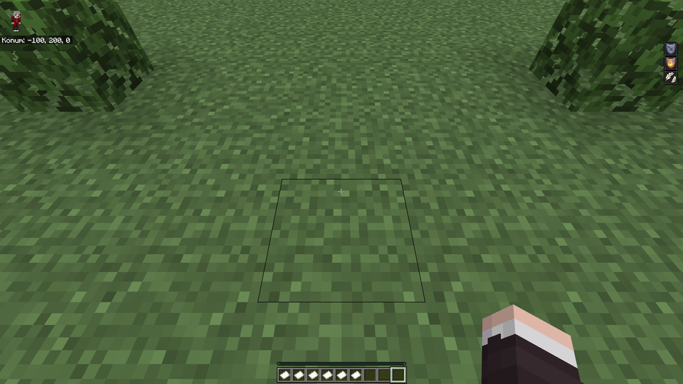

# UI campaign, provider coverage and custom biomes - 4 October 2026

Twilight 1.0.0-pre.7 was checked against every resolvable menu of two real servers,
an original-art style suite that reproduces the menu techniques found there, complete
builds of six real servers and a live custom-biome scene. All checks ran on isolated
copies; production servers were only read. Every screenshot in this repository was
captured on 4 October with the release build; older screenshots were retired.

## Real menus

`ui-campaign.py` collects menu titles from the server's own plugin configurations
(DeluxeMenus and every plugin YAML with a title and size), resolves them like the
running plugins would (legacy, hex and MiniMessage colours, ItemsAdder `:name:` and
`%img_name%` images and `:offset_N:` shifts from the server's own caches,
`{player}`), installs the pack the server delivers to Java players in the Java
client and Twilight's complete build of the same server in Geyser, then opens each
title on both clients. Titles with unresolved placeholders are skipped. Positions are
measured in GUI units on the slot grid (whole window) and on the title band.

| Server | Menus | Font-image titles | Text titles | Window offset 0 | Title band offset 0 |
| --- | --- | --- | --- | --- | --- |
| Survival (CraftEngine, ItemsAdder, CustomNameplates, BetterModel) | 88 | 40 | 48 | 88 | 82 |
| Box PvP (ItemsAdder, ModelEngine) | 16 | 0 | 16 | 16 | 15 |

The remaining title-band differences are Bedrock's own text rendering, not image
placement: Bedrock's font draws some characters with other widths (Turkish `ı`, `ğ`,
bold text, one or two units over a line), and a title containing a character
Bedrock's default font lacks (`❘`) is drawn entirely in Bedrock's smaller unicode
font. One font-image title measured a three-unit vertical band difference in one run
and none in a repeat run; it has semi-transparent art over the chest border.

The campaign found and fixed three defects in this release:

| Defect | Before | After |
| --- | --- | --- |
| Titles without a colour code: Java multiplies glyph images by the default title colour `0x404040`, Bedrock showed them undarkened | mean art difference 78.6 and 74.9 (two menus) | 16.1 and 12.9; brightest art pixel 64 on both clients |
| Bold titles: Bedrock widens bold spacers, so the origin padding moved the line | 4 units right | 0 |
| Pack translations: Java shows the packs' strings (names, hidden inventory label) | Bedrock showed vanilla strings | merged pack strings for every locale |

The real menus use third-party GUI art, so they are published as measurements only:
[Survival](images/acceptance/2026-10-04-ui-campaign/survival/measurements.json),
[Box PvP](images/acceptance/2026-10-04-ui-campaign/boxpvp/measurements.json).

## Original-art style suite

`style-suite.py` draws its own art and builds a resource pack with the techniques the
real servers use; nothing is copied from a server, so all captures are published.

| Style | Technique | Result |
| --- | --- | --- |
| Header, no colour | 76-unit header above the chest after an `-8` space, title without a colour | exact; darkened like Java (art difference 0.2) |
| Header, white | same with `&f` | exact (0.2) |
| Icon row | icons separated by `+4` and `-1` spaces, coloured text | exact |
| Negative-height shifts | eight Jobs-style negative-height bitmaps, then the header | exact |
| Hex text | `&#FFAA00` and legacy colours | exact |
| Bold text | `&b&l` title | exact |
| Layered | banner moved back over the header with a `-121` space, then bold text | **not reproduced**: Bedrock text cannot move left, so the banner and text follow the header instead of overlapping it |

<table>
  <tr><th>Java - title without a colour</th><th>Bedrock - darkened copies</th></tr>
  <tr>
    <td></td>
    <td></td>
  </tr>
  <tr><th>Java - white title</th><th>Bedrock</th></tr>
  <tr>
    <td></td>
    <td></td>
  </tr>
  <tr><th>Java - layered title</th><th>Bedrock - layers not reproduced</th></tr>
  <tr>
    <td></td>
    <td></td>
  </tr>
</table>

Further pairs: [icon row](images/acceptance/2026-10-04-ui-campaign/style-suite/icon-row-java.png)
([Bedrock](images/acceptance/2026-10-04-ui-campaign/style-suite/icon-row-bedrock.png)),
[negative-height shifts](images/acceptance/2026-10-04-ui-campaign/style-suite/negative-height-java.png)
([Bedrock](images/acceptance/2026-10-04-ui-campaign/style-suite/negative-height-bedrock.png)),
[hex text](images/acceptance/2026-10-04-ui-campaign/style-suite/hex-text-java.png)
([Bedrock](images/acceptance/2026-10-04-ui-campaign/style-suite/hex-text-bedrock.png)),
[bold text](images/acceptance/2026-10-04-ui-campaign/style-suite/bold-text-java.png)
([Bedrock](images/acceptance/2026-10-04-ui-campaign/style-suite/bold-text-bedrock.png));
[measurements](images/acceptance/2026-10-04-ui-campaign/style-suite/measurements.json),
[hashes](images/acceptance/2026-10-04-ui-campaign/style-suite/sha256.json).
The Java client runs in English and the Bedrock client in Turkish, hence
"Inventory" and "Envanter".

### Darkened copies

Bedrock never tints resource-pack glyphs with the text colour: a probe showed
private-use pages untinted in every colour, and non-private pages tinted but always
drawn at half size, whatever their resolution, so they cannot carry menu art. The
pack therefore receives copies of the laid-out glyphs multiplied by `0x404040` on
free private-use pages, and container titles without a colour use them. Other
surfaces default to white and keep the originals. On Survival this adds nine pages
(21 instead of 12, about 330 MiB of uncompressed atlas memory, 1.3 MB of pack size);
`ui.java-glyph-tint: false` removes them. Titles with a colour other than white or
the default are not darkened (none of the 104 real titles uses one before an image).

## Provider coverage and production builds

Discovery now treats each provider's generated pack as what Java players receive:
CraftEngine's `generated/resource_pack.zip` (which also merges CustomNameplates and
BetterModel output), ItemsAdder's output and Nexo/Oraxen packs outrank the
providers' working folders. A provider whose plugin is not installed (a leftover
ItemsAdder folder on a CraftEngine server) or whose settings do not send its pack
while another provider sends a generated pack only fills gaps. CustomNameplates and
BetterHUD packs are discovered; Nexo's vanilla asset cache is ignored.

| Server (sources) | pre.6 | pre.7 |
| --- | --- | --- |
| Survival (CraftEngine, ItemsAdder folder, CustomNameplates, BetterModel, ModelEngine, world datapack) | 837 / 841 | 1,905 / 1,932 |
| SkyBlock (CraftEngine, ItemsAdder folder, CustomNameplates, BetterModel) | 29 / 52 | 29 / 52 (21 skin-rendered heads noted) |
| Box PvP v2 (ItemsAdder, BetterModel, ModelEngine) | 805 / 811 | 884 / 902 |
| Box PvP (ItemsAdder, ModelEngine) | 539 / 845 | 612 / 928 |
| Kaynak (ItemsAdder, Nexo files, CustomNameplates, ModelEngine) | - | 2,713 / 3,014 |
| SMP Lifesteal (datapack only) | 0 / 0 | 0 / 0 |

Converted / candidate custom items per complete build. The larger candidate counts
come from the delivered packs that were previously outranked by stale folders.
Remaining failures are missing textures and models in the servers' own packs (as on
Java) and the documented limits of 3D provider models. MMO plugins (MMOItems,
MythicMobs items) use the item models of these packs and are converted with them;
MythicMobs entities need a runtime entity bridge (see the
[compatibility contract](COMPATIBILITY.md)). Nexo was tested from files only: no
test server runs the Nexo plugin.

Survival's packs define 23,379 strings in 122 locales. Twilight merges them like
Java and Geyser renders Java text with them; Bedrock's own inventory label follows
the pack (a blank label stays blank).

## Custom biomes

Geyser shows every biome it does not know as the dimension's fallback (ocean in the
overworld), so datapack biomes (Terralith, Incendium) and plugin biomes
(RealisticSeasons) lost their colours on Bedrock. Twilight now registers each custom
biome for Bedrock as the vanilla biome with the closest grass, foliage, water and fog
colours and precipitation, computed from the biome's Java definition and the vanilla
colour maps (`world.bedrock-biome-matching`).

`biome-check.py` installed a datapack biome `twilighttest:blossom_vale` (the cherry
grove definition with its own grass and foliage colours) in the test world, painted a
grass floor with `/fillbiome` and captured both clients. Twilight logged
`blossom_vale=minecraft:cherry_grove`.

| Client | Mean floor colour (RGB) |
| --- | --- |
| Java | 112, 129, 65 |
| Bedrock with the mapping | 102, 123, 54 |
| Bedrock without it (ocean fallback) | 79, 103, 62 |

<table>
  <tr><th>Java</th><th>Bedrock - mapped</th><th>Bedrock - ocean fallback</th></tr>
  <tr>
    <td></td>
    <td></td>
    <td></td>
  </tr>
</table>

The mapping uses vanilla Bedrock biomes, so exact custom colours are not reproduced;
persistent leaves kept Bedrock's own colour. [Measurements](images/acceptance/2026-10-04-biomes/measurements.json),
[hashes](images/acceptance/2026-10-04-biomes/sha256.json).

## Remaining differences

- Layers moved back over an earlier image (a negative space after an image) are not
  reproduced; titles that only shift before their images are exact.
- Bedrock draws text with its own font: some character widths differ, and a
  character missing from its default font switches the whole title to the unicode
  font.
- Bedrock adds its close button and inventory label in the client's language.
- Item names and lore are not rewritten; high-resolution glyphs are sampled to GUI
  units.
